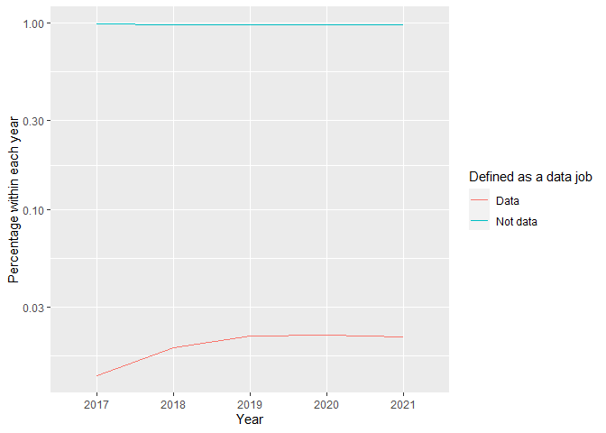

Historial extract from iworkforsa - lab book
================
ofchurches
28 June 2021

# Background

This markdown is a preliminary investigation of the data provided by the [Office of the Commissioner for Public Sector Employment](https://www.publicsector.sa.gov.au/).The data contains details from every advertisment on [iworkforsa.gov.au](https://iworkfor.sa.gov.au/).

Note that these data have been classified as "Public" by the OCPSE.

## Packages

``` r
library(readxl)
library(tidyverse)
library(here)
library(lubridate)
library(kableExtra)
library(naniar)
library(patchwork)
library(skimr)
```

## Import, arrange and format

``` r
path <- here("IWORK4SA Data 2017-2021, Classification-Public.xlsx")

advertiments <- path %>% 
  excel_sheets() %>%
  map_dfr(
    function(sheet) {
      temp = read_excel(sheet, path = path, skip = 8)
      mutate(temp, Year = sheet)
    }
  )
```

## Checks and balances

### Check the top and bottom of the data

Data read in from `xlsx` files often has bits of extra information above *and* below the actual "data". To check that we haven't accidentaly imported that we can have a look at the top and bottom of our dataset.

``` r
advertiments %>%
  slice_head(n = 3) %>%
  kable() %>%
  kable_styling()
```

<table class="table" style="margin-left: auto; margin-right: auto;">
<thead>
<tr>
<th style="text-align:left;">
Date Publish To Public Drill
</th>
<th style="text-align:left;">
Division
</th>
<th style="text-align:left;">
Position Status
</th>
<th style="text-align:left;">
I Workfor SA Classification Level
</th>
<th style="text-align:left;">
Position ID
</th>
<th style="text-align:left;">
Position ID Job Title
</th>
<th style="text-align:left;">
I Workfor SA Vacancy Type
</th>
<th style="text-align:left;">
I Workfor SA Part Time
</th>
<th style="text-align:left;">
I Workfor SA Part Time Hours
</th>
<th style="text-align:left;">
I Workfor SA Location
</th>
<th style="text-align:left;">
I Workfor SA Min Salary
</th>
<th style="text-align:left;">
I Workfor SA Max Salary
</th>
<th style="text-align:left;">
I Workfor SA Employment Status
</th>
<th style="text-align:left;">
I Workfor SA Job Category
</th>
<th style="text-align:left;">
Year
</th>
</tr>
</thead>
<tbody>
<tr>
<td style="text-align:left;">
2017-11-04
</td>
<td style="text-align:left;">
Department for Child Protection
</td>
<td style="text-align:left;">
Position Closed
</td>
<td style="text-align:left;">
AHP3 - Allied Health Professional
</td>
<td style="text-align:left;">
294895
</td>
<td style="text-align:left;">
294895 - Supervisor
</td>
<td style="text-align:left;">
Open to Everyone
</td>
<td style="text-align:left;">
No
</td>
<td style="text-align:left;">
0
</td>
<td style="text-align:left;">
5540 - PORT PIRIE
</td>
<td style="text-align:left;">
92757
</td>
<td style="text-align:left;">
98896
</td>
<td style="text-align:left;">
Ongoing
</td>
<td style="text-align:left;">
Community and Social Services, Child, Aged and Disability Care
</td>
<td style="text-align:left;">
2017
</td>
</tr>
<tr>
<td style="text-align:left;">
2017-11-04
</td>
<td style="text-align:left;">
Department for Child Protection
</td>
<td style="text-align:left;">
Position Closed
</td>
<td style="text-align:left;">
PO3 - Professional Officer
</td>
<td style="text-align:left;">
294897
</td>
<td style="text-align:left;">
294897 - Supervisor
</td>
<td style="text-align:left;">
Open to Everyone
</td>
<td style="text-align:left;">
No
</td>
<td style="text-align:left;">
0
</td>
<td style="text-align:left;">
5540 - PORT PIRIE
</td>
<td style="text-align:left;">
90029
</td>
<td style="text-align:left;">
95487
</td>
<td style="text-align:left;">
Ongoing
</td>
<td style="text-align:left;">
Community and Social Services, Child, Aged and Disability Care
</td>
<td style="text-align:left;">
2017
</td>
</tr>
<tr>
<td style="text-align:left;">
2017-11-04
</td>
<td style="text-align:left;">
Department for Education
</td>
<td style="text-align:left;">
Position Closed
</td>
<td style="text-align:left;">
AHP3 - Allied Health Professional
</td>
<td style="text-align:left;">
294898
</td>
<td style="text-align:left;">
294898 - Psychologist, Centre for Hearing Impaired
</td>
<td style="text-align:left;">
Open to Everyone
</td>
<td style="text-align:left;">
No
</td>
<td style="text-align:left;">
45
</td>
<td style="text-align:left;">
5000 - ADELAIDE
</td>
<td style="text-align:left;">
92757
</td>
<td style="text-align:left;">
98896
</td>
<td style="text-align:left;">
Ongoing
</td>
<td style="text-align:left;">
Community and Social Services, Child, Aged and Disability Care
</td>
<td style="text-align:left;">
2017
</td>
</tr>
</tbody>
</table>
``` r
advertiments %>%
  slice_tail(n = 3) %>%
  kable() %>%
  kable_styling()
```

<table class="table" style="margin-left: auto; margin-right: auto;">
<thead>
<tr>
<th style="text-align:left;">
Date Publish To Public Drill
</th>
<th style="text-align:left;">
Division
</th>
<th style="text-align:left;">
Position Status
</th>
<th style="text-align:left;">
I Workfor SA Classification Level
</th>
<th style="text-align:left;">
Position ID
</th>
<th style="text-align:left;">
Position ID Job Title
</th>
<th style="text-align:left;">
I Workfor SA Vacancy Type
</th>
<th style="text-align:left;">
I Workfor SA Part Time
</th>
<th style="text-align:left;">
I Workfor SA Part Time Hours
</th>
<th style="text-align:left;">
I Workfor SA Location
</th>
<th style="text-align:left;">
I Workfor SA Min Salary
</th>
<th style="text-align:left;">
I Workfor SA Max Salary
</th>
<th style="text-align:left;">
I Workfor SA Employment Status
</th>
<th style="text-align:left;">
I Workfor SA Job Category
</th>
<th style="text-align:left;">
Year
</th>
</tr>
</thead>
<tbody>
<tr>
<td style="text-align:left;">
NA
</td>
<td style="text-align:left;">
Green Industries SA
</td>
<td style="text-align:left;">
Created
</td>
<td style="text-align:left;">
NA
</td>
<td style="text-align:left;">
439435
</td>
<td style="text-align:left;">
439435 - Default template
</td>
<td style="text-align:left;">
NA
</td>
<td style="text-align:left;">
No
</td>
<td style="text-align:left;">
NA
</td>
<td style="text-align:left;">
5000 - ADELAIDE
</td>
<td style="text-align:left;">
NA
</td>
<td style="text-align:left;">
NA
</td>
<td style="text-align:left;">
NA
</td>
<td style="text-align:left;">
NA
</td>
<td style="text-align:left;">
2021
</td>
</tr>
<tr>
<td style="text-align:left;">
NA
</td>
<td style="text-align:left;">
NA
</td>
<td style="text-align:left;">
NA
</td>
<td style="text-align:left;">
NA
</td>
<td style="text-align:left;">
NA
</td>
<td style="text-align:left;">
NA
</td>
<td style="text-align:left;">
NA
</td>
<td style="text-align:left;">
NA
</td>
<td style="text-align:left;">
NA
</td>
<td style="text-align:left;">
NA
</td>
<td style="text-align:left;">
NA
</td>
<td style="text-align:left;">
NA
</td>
<td style="text-align:left;">
NA
</td>
<td style="text-align:left;">
NA
</td>
<td style="text-align:left;">
2021
</td>
</tr>
<tr>
<td style="text-align:left;">
Report created on: 9/06/2021 3:42:28 PM
</td>
<td style="text-align:left;">
NA
</td>
<td style="text-align:left;">
NA
</td>
<td style="text-align:left;">
NA
</td>
<td style="text-align:left;">
NA
</td>
<td style="text-align:left;">
NA
</td>
<td style="text-align:left;">
NA
</td>
<td style="text-align:left;">
NA
</td>
<td style="text-align:left;">
NA
</td>
<td style="text-align:left;">
NA
</td>
<td style="text-align:left;">
NA
</td>
<td style="text-align:left;">
NA
</td>
<td style="text-align:left;">
NA
</td>
<td style="text-align:left;">
NA
</td>
<td style="text-align:left;">
2021
</td>
</tr>
</tbody>
</table>
It looks like we've imported some extra rows that we don't want because they were footer details and some `NA` whole rows. We can remove them.

``` r
advertiments_clean <- advertiments%>%
  filter(str_detect(`Date Publish To Public Drill`, "Report created") == FALSE | is.na(`Date Publish To Public Drill`) == TRUE) %>%
  filter(is.na(`Position ID Job Title`) == FALSE)
```

Just to check this again. We imported five sheets from the `xlsx` file so `advertiments_clean` should now fave five less rows than `advertisments`. And, the difference in rows is: 10!

### Change format

Let's put the variables in a format that we can treat appropriately.

``` r
advertiments_formatted <- advertiments_clean %>% 
  mutate(`Date Publish To Public Drill` = ymd(`Date Publish To Public Drill`)) %>%
  mutate(`I Workfor SA Min Salary` = as.numeric(`I Workfor SA Min Salary`)) %>%
  mutate(`I Workfor SA Max Salary` = as.numeric(`I Workfor SA Max Salary`))
```

    ## Warning in mask$eval_all_mutate(quo): NAs introduced by coercion

    ## Warning in mask$eval_all_mutate(quo): NAs introduced by coercion

### What are we working with

It would be good to have a look at the data types in each variable to work out if its suitable for what we'll want to do in the analysis.

``` r
advertiments_formatted %>%
  skim()
```

<table style="width: auto;" class="table table-condensed">
<caption>
Data summary
</caption>
<thead>
<tr>
<th style="text-align:left;">
</th>
<th style="text-align:left;">
</th>
</tr>
</thead>
<tbody>
<tr>
<td style="text-align:left;">
Name
</td>
<td style="text-align:left;">
Piped data
</td>
</tr>
<tr>
<td style="text-align:left;">
Number of rows
</td>
<td style="text-align:left;">
35532
</td>
</tr>
<tr>
<td style="text-align:left;">
Number of columns
</td>
<td style="text-align:left;">
15
</td>
</tr>
<tr>
<td style="text-align:left;">
\_\_\_\_\_\_\_\_\_\_\_\_\_\_\_\_\_\_\_\_\_\_\_
</td>
<td style="text-align:left;">
</td>
</tr>
<tr>
<td style="text-align:left;">
Column type frequency:
</td>
<td style="text-align:left;">
</td>
</tr>
<tr>
<td style="text-align:left;">
character
</td>
<td style="text-align:left;">
12
</td>
</tr>
<tr>
<td style="text-align:left;">
Date
</td>
<td style="text-align:left;">
1
</td>
</tr>
<tr>
<td style="text-align:left;">
numeric
</td>
<td style="text-align:left;">
2
</td>
</tr>
<tr>
<td style="text-align:left;">
\_\_\_\_\_\_\_\_\_\_\_\_\_\_\_\_\_\_\_\_\_\_\_\_
</td>
<td style="text-align:left;">
</td>
</tr>
<tr>
<td style="text-align:left;">
Group variables
</td>
<td style="text-align:left;">
None
</td>
</tr>
</tbody>
</table>
**Variable type: character**

<table>
<thead>
<tr>
<th style="text-align:left;">
skim\_variable
</th>
<th style="text-align:right;">
n\_missing
</th>
<th style="text-align:right;">
complete\_rate
</th>
<th style="text-align:right;">
min
</th>
<th style="text-align:right;">
max
</th>
<th style="text-align:right;">
empty
</th>
<th style="text-align:right;">
n\_unique
</th>
<th style="text-align:right;">
whitespace
</th>
</tr>
</thead>
<tbody>
<tr>
<td style="text-align:left;">
Division
</td>
<td style="text-align:right;">
0
</td>
<td style="text-align:right;">
1.00
</td>
<td style="text-align:right;">
7
</td>
<td style="text-align:right;">
55
</td>
<td style="text-align:right;">
0
</td>
<td style="text-align:right;">
69
</td>
<td style="text-align:right;">
0
</td>
</tr>
<tr>
<td style="text-align:left;">
Position Status
</td>
<td style="text-align:right;">
0
</td>
<td style="text-align:right;">
1.00
</td>
<td style="text-align:right;">
4
</td>
<td style="text-align:right;">
32
</td>
<td style="text-align:right;">
0
</td>
<td style="text-align:right;">
9
</td>
<td style="text-align:right;">
0
</td>
</tr>
<tr>
<td style="text-align:left;">
I Workfor SA Classification Level
</td>
<td style="text-align:right;">
887
</td>
<td style="text-align:right;">
0.98
</td>
<td style="text-align:right;">
9
</td>
<td style="text-align:right;">
74
</td>
<td style="text-align:right;">
0
</td>
<td style="text-align:right;">
325
</td>
<td style="text-align:right;">
0
</td>
</tr>
<tr>
<td style="text-align:left;">
Position ID
</td>
<td style="text-align:right;">
0
</td>
<td style="text-align:right;">
1.00
</td>
<td style="text-align:right;">
6
</td>
<td style="text-align:right;">
6
</td>
<td style="text-align:right;">
0
</td>
<td style="text-align:right;">
35532
</td>
<td style="text-align:right;">
0
</td>
</tr>
<tr>
<td style="text-align:left;">
Position ID Job Title
</td>
<td style="text-align:right;">
0
</td>
<td style="text-align:right;">
1.00
</td>
<td style="text-align:right;">
8
</td>
<td style="text-align:right;">
163
</td>
<td style="text-align:right;">
0
</td>
<td style="text-align:right;">
35532
</td>
<td style="text-align:right;">
0
</td>
</tr>
<tr>
<td style="text-align:left;">
I Workfor SA Vacancy Type
</td>
<td style="text-align:right;">
448
</td>
<td style="text-align:right;">
0.99
</td>
<td style="text-align:right;">
16
</td>
<td style="text-align:right;">
31
</td>
<td style="text-align:right;">
0
</td>
<td style="text-align:right;">
2
</td>
<td style="text-align:right;">
0
</td>
</tr>
<tr>
<td style="text-align:left;">
I Workfor SA Part Time
</td>
<td style="text-align:right;">
0
</td>
<td style="text-align:right;">
1.00
</td>
<td style="text-align:right;">
2
</td>
<td style="text-align:right;">
3
</td>
<td style="text-align:right;">
0
</td>
<td style="text-align:right;">
2
</td>
<td style="text-align:right;">
0
</td>
</tr>
<tr>
<td style="text-align:left;">
I Workfor SA Part Time Hours
</td>
<td style="text-align:right;">
21410
</td>
<td style="text-align:right;">
0.40
</td>
<td style="text-align:right;">
1
</td>
<td style="text-align:right;">
14
</td>
<td style="text-align:right;">
0
</td>
<td style="text-align:right;">
383
</td>
<td style="text-align:right;">
0
</td>
</tr>
<tr>
<td style="text-align:left;">
I Workfor SA Location
</td>
<td style="text-align:right;">
40
</td>
<td style="text-align:right;">
1.00
</td>
<td style="text-align:right;">
11
</td>
<td style="text-align:right;">
44
</td>
<td style="text-align:right;">
0
</td>
<td style="text-align:right;">
320
</td>
<td style="text-align:right;">
0
</td>
</tr>
<tr>
<td style="text-align:left;">
I Workfor SA Employment Status
</td>
<td style="text-align:right;">
451
</td>
<td style="text-align:right;">
0.99
</td>
<td style="text-align:right;">
6
</td>
<td style="text-align:right;">
19
</td>
<td style="text-align:right;">
0
</td>
<td style="text-align:right;">
4
</td>
<td style="text-align:right;">
0
</td>
</tr>
<tr>
<td style="text-align:left;">
I Workfor SA Job Category
</td>
<td style="text-align:right;">
453
</td>
<td style="text-align:right;">
0.99
</td>
<td style="text-align:right;">
6
</td>
<td style="text-align:right;">
62
</td>
<td style="text-align:right;">
0
</td>
<td style="text-align:right;">
41
</td>
<td style="text-align:right;">
0
</td>
</tr>
<tr>
<td style="text-align:left;">
Year
</td>
<td style="text-align:right;">
0
</td>
<td style="text-align:right;">
1.00
</td>
<td style="text-align:right;">
4
</td>
<td style="text-align:right;">
4
</td>
<td style="text-align:right;">
0
</td>
<td style="text-align:right;">
5
</td>
<td style="text-align:right;">
0
</td>
</tr>
</tbody>
</table>
**Variable type: Date**

<table>
<thead>
<tr>
<th style="text-align:left;">
skim\_variable
</th>
<th style="text-align:right;">
n\_missing
</th>
<th style="text-align:right;">
complete\_rate
</th>
<th style="text-align:left;">
min
</th>
<th style="text-align:left;">
max
</th>
<th style="text-align:left;">
median
</th>
<th style="text-align:right;">
n\_unique
</th>
</tr>
</thead>
<tbody>
<tr>
<td style="text-align:left;">
Date Publish To Public Drill
</td>
<td style="text-align:right;">
2384
</td>
<td style="text-align:right;">
0.93
</td>
<td style="text-align:left;">
2017-11-04
</td>
<td style="text-align:left;">
2021-06-08
</td>
<td style="text-align:left;">
2019-09-24
</td>
<td style="text-align:right;">
1017
</td>
</tr>
</tbody>
</table>
**Variable type: numeric**

<table>
<thead>
<tr>
<th style="text-align:left;">
skim\_variable
</th>
<th style="text-align:right;">
n\_missing
</th>
<th style="text-align:right;">
complete\_rate
</th>
<th style="text-align:right;">
mean
</th>
<th style="text-align:right;">
sd
</th>
<th style="text-align:right;">
p0
</th>
<th style="text-align:right;">
p25
</th>
<th style="text-align:right;">
p50
</th>
<th style="text-align:right;">
p75
</th>
<th style="text-align:right;">
p100
</th>
<th style="text-align:left;">
hist
</th>
</tr>
</thead>
<tbody>
<tr>
<td style="text-align:left;">
I Workfor SA Min Salary
</td>
<td style="text-align:right;">
826
</td>
<td style="text-align:right;">
0.98
</td>
<td style="text-align:right;">
75939.52
</td>
<td style="text-align:right;">
30251.57
</td>
<td style="text-align:right;">
0
</td>
<td style="text-align:right;">
60681
</td>
<td style="text-align:right;">
75430
</td>
<td style="text-align:right;">
92784
</td>
<td style="text-align:right;">
324141
</td>
<td style="text-align:left;">
&lt;U+2586&gt;&lt;U+2587&gt;&lt;U+2581&gt;&lt;U+2581&gt;&lt;U+2581&gt;
</td>
</tr>
<tr>
<td style="text-align:left;">
I Workfor SA Max Salary
</td>
<td style="text-align:right;">
826
</td>
<td style="text-align:right;">
0.98
</td>
<td style="text-align:right;">
87480.98
</td>
<td style="text-align:right;">
38156.83
</td>
<td style="text-align:right;">
0
</td>
<td style="text-align:right;">
66368
</td>
<td style="text-align:right;">
88420
</td>
<td style="text-align:right;">
101685
</td>
<td style="text-align:right;">
413381
</td>
<td style="text-align:left;">
&lt;U+2585&gt;&lt;U+2587&gt;&lt;U+2581&gt;&lt;U+2581&gt;&lt;U+2581&gt;
</td>
</tr>
</tbody>
</table>
### Missing data

``` r
advertiments_formatted %>%
  gg_miss_var(show_pct = TRUE, facet = Year) +
  labs(title = str_wrap("Percent of missing data for each variable in `advertisments`", width = 50))
```


It seems that all the variables except `I Workfor SA Part Time Hours` have minimal missing values and none of this changes much over time.

``` r
gg_miss_upset(advertiments_formatted)
```


Its reasuring that `I Workfor SA Min Salary` and `I Workfor SA MAX Salary` are only missing in combination with each other (and sometimes with `I Workfor SA Part Time Hours` as well).

The only note that appears particularly pertinent from these analyses is that `I Workfor SA Part Time Hours` should be treated with caution. We should note that the variables: `Division`, `Position Status`, `Position ID`, `Position ID Job Title`, `I Workfor SA Part Time` and `Year` are all completed with no missing values.

# Analyses

## "Data" jobs

The motivation for getting these data that Owen and Tim talked about was to look at advertisments for "data" jobs to investigate questions such as:

-   Are they increasing as a proportion of the advertisments?
-   What departments are recruiting them?
-   What sort of work are they being anticipated to do?

### Definition caveats

To answer this question we need a definition of "data" jobs.

We can do this by including words and word-parts that signify the sort of job we are interested in. It is worth stating up front that this is necessarily a decision process rather than a data process. That is, the jobs we end up with classified as "data" and "not data" will be so classified because of our subjective *decision* not because of some objective *data*. In addition, this has a signal detection characteristic in that sue to that application of a strict definition, there will be errors both due to some "not data" jobs which end up classified as "data jobs" and some "data jobs" that end up classified as "not data jobs".

### Definition

Regardless, we can set the definition and accept these caveats. Importantly, because the new variable `Defined as a data job` is based on `Position ID Job Title`, there will be no missing values in this new variable.

Data jobs will be defined as such:

``` r
data_job_definitions <- c("data", "analyt", "information", "intelligence", "statistic")

advertiments_defined <- advertiments_formatted %>% 
  mutate(`Defined as a data job` = ifelse(str_detect(str_to_lower(`Position ID Job Title`), paste(data_job_definitions, collapse = "|")), 
         "Data", "Not data"))
```

## Answers

### Are "data jobs" increasing as a proportion of the advertisments?

``` r
advertiments_defined %>%
  group_by(`Defined as a data job`, Year) %>%
  count() %>%
  group_by(Year) %>%
  mutate(`Percentage within each year`= n/sum(n)) %>%
  ggplot(aes(x = Year, y = `Percentage within each year`, colour = `Defined as a data job`, group = `Defined as a data job`)) + 
  geom_line() + 
  scale_y_log10()
```


