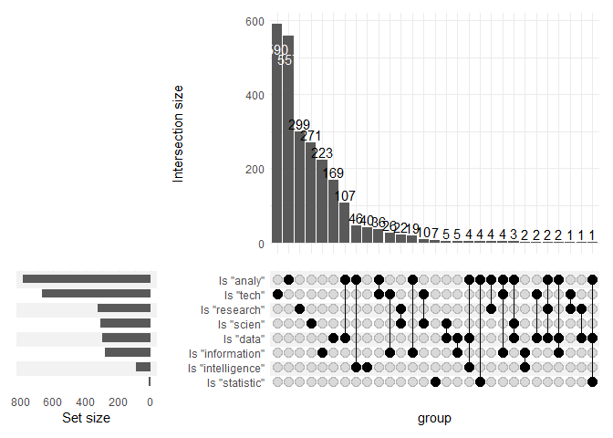

Historial extract from iworkforsa - lab book
================
ofchurches
28 June 2021

# Background

This markdown is a preliminary investigation of the data provided by the [Office of the Commissioner for Public Sector Employment](https://www.publicsector.sa.gov.au/).The data contains details from every advertisment on [iworkforsa.gov.au](https://iworkfor.sa.gov.au/).

Note that these data have been classified as "Public" by the OCPSE.

## Packages

``` r
library(readxl)
library(tidyverse)
library(here)
library(lubridate)
library(kableExtra)
library(naniar)
library(patchwork)
library(skimr)
```

## Import, arrange and format

``` r
path <- here("IWORK4SA Data 2017-2021, Classification-Public.xlsx")

advertiments <- path %>% 
  excel_sheets() %>%
  map_dfr(
    function(sheet) {
      temp = read_excel(sheet, path = path, skip = 8)
      mutate(temp, Year = sheet)
    }
  )
```

## Checks and balances

### Check the top and bottom of the data

Data read in from `xlsx` files often has bits of extra information above *and* below the actual "data". To check that we haven't accidentaly imported that we can have a look at the top and bottom of our dataset.

``` r
advertiments %>%
  slice_head(n = 3) %>%
  kable() %>%
  kable_styling()
```

<table class="table" style="margin-left: auto; margin-right: auto;">
<thead>
<tr>
<th style="text-align:left;">
Date Publish To Public Drill
</th>
<th style="text-align:left;">
Division
</th>
<th style="text-align:left;">
Position Status
</th>
<th style="text-align:left;">
I Workfor SA Classification Level
</th>
<th style="text-align:left;">
Position ID
</th>
<th style="text-align:left;">
Position ID Job Title
</th>
<th style="text-align:left;">
I Workfor SA Vacancy Type
</th>
<th style="text-align:left;">
I Workfor SA Part Time
</th>
<th style="text-align:left;">
I Workfor SA Part Time Hours
</th>
<th style="text-align:left;">
I Workfor SA Location
</th>
<th style="text-align:left;">
I Workfor SA Min Salary
</th>
<th style="text-align:left;">
I Workfor SA Max Salary
</th>
<th style="text-align:left;">
I Workfor SA Employment Status
</th>
<th style="text-align:left;">
I Workfor SA Job Category
</th>
<th style="text-align:left;">
Year
</th>
</tr>
</thead>
<tbody>
<tr>
<td style="text-align:left;">
2017-11-04
</td>
<td style="text-align:left;">
Department for Child Protection
</td>
<td style="text-align:left;">
Position Closed
</td>
<td style="text-align:left;">
AHP3 - Allied Health Professional
</td>
<td style="text-align:left;">
294895
</td>
<td style="text-align:left;">
294895 - Supervisor
</td>
<td style="text-align:left;">
Open to Everyone
</td>
<td style="text-align:left;">
No
</td>
<td style="text-align:left;">
0
</td>
<td style="text-align:left;">
5540 - PORT PIRIE
</td>
<td style="text-align:left;">
92757
</td>
<td style="text-align:left;">
98896
</td>
<td style="text-align:left;">
Ongoing
</td>
<td style="text-align:left;">
Community and Social Services, Child, Aged and Disability Care
</td>
<td style="text-align:left;">
2017
</td>
</tr>
<tr>
<td style="text-align:left;">
2017-11-04
</td>
<td style="text-align:left;">
Department for Child Protection
</td>
<td style="text-align:left;">
Position Closed
</td>
<td style="text-align:left;">
PO3 - Professional Officer
</td>
<td style="text-align:left;">
294897
</td>
<td style="text-align:left;">
294897 - Supervisor
</td>
<td style="text-align:left;">
Open to Everyone
</td>
<td style="text-align:left;">
No
</td>
<td style="text-align:left;">
0
</td>
<td style="text-align:left;">
5540 - PORT PIRIE
</td>
<td style="text-align:left;">
90029
</td>
<td style="text-align:left;">
95487
</td>
<td style="text-align:left;">
Ongoing
</td>
<td style="text-align:left;">
Community and Social Services, Child, Aged and Disability Care
</td>
<td style="text-align:left;">
2017
</td>
</tr>
<tr>
<td style="text-align:left;">
2017-11-04
</td>
<td style="text-align:left;">
Department for Education
</td>
<td style="text-align:left;">
Position Closed
</td>
<td style="text-align:left;">
AHP3 - Allied Health Professional
</td>
<td style="text-align:left;">
294898
</td>
<td style="text-align:left;">
294898 - Psychologist, Centre for Hearing Impaired
</td>
<td style="text-align:left;">
Open to Everyone
</td>
<td style="text-align:left;">
No
</td>
<td style="text-align:left;">
45
</td>
<td style="text-align:left;">
5000 - ADELAIDE
</td>
<td style="text-align:left;">
92757
</td>
<td style="text-align:left;">
98896
</td>
<td style="text-align:left;">
Ongoing
</td>
<td style="text-align:left;">
Community and Social Services, Child, Aged and Disability Care
</td>
<td style="text-align:left;">
2017
</td>
</tr>
</tbody>
</table>
``` r
advertiments %>%
  slice_tail(n = 3) %>%
  kable() %>%
  kable_styling()
```

<table class="table" style="margin-left: auto; margin-right: auto;">
<thead>
<tr>
<th style="text-align:left;">
Date Publish To Public Drill
</th>
<th style="text-align:left;">
Division
</th>
<th style="text-align:left;">
Position Status
</th>
<th style="text-align:left;">
I Workfor SA Classification Level
</th>
<th style="text-align:left;">
Position ID
</th>
<th style="text-align:left;">
Position ID Job Title
</th>
<th style="text-align:left;">
I Workfor SA Vacancy Type
</th>
<th style="text-align:left;">
I Workfor SA Part Time
</th>
<th style="text-align:left;">
I Workfor SA Part Time Hours
</th>
<th style="text-align:left;">
I Workfor SA Location
</th>
<th style="text-align:left;">
I Workfor SA Min Salary
</th>
<th style="text-align:left;">
I Workfor SA Max Salary
</th>
<th style="text-align:left;">
I Workfor SA Employment Status
</th>
<th style="text-align:left;">
I Workfor SA Job Category
</th>
<th style="text-align:left;">
Year
</th>
</tr>
</thead>
<tbody>
<tr>
<td style="text-align:left;">
NA
</td>
<td style="text-align:left;">
Green Industries SA
</td>
<td style="text-align:left;">
Created
</td>
<td style="text-align:left;">
NA
</td>
<td style="text-align:left;">
439435
</td>
<td style="text-align:left;">
439435 - Default template
</td>
<td style="text-align:left;">
NA
</td>
<td style="text-align:left;">
No
</td>
<td style="text-align:left;">
NA
</td>
<td style="text-align:left;">
5000 - ADELAIDE
</td>
<td style="text-align:left;">
NA
</td>
<td style="text-align:left;">
NA
</td>
<td style="text-align:left;">
NA
</td>
<td style="text-align:left;">
NA
</td>
<td style="text-align:left;">
2021
</td>
</tr>
<tr>
<td style="text-align:left;">
NA
</td>
<td style="text-align:left;">
NA
</td>
<td style="text-align:left;">
NA
</td>
<td style="text-align:left;">
NA
</td>
<td style="text-align:left;">
NA
</td>
<td style="text-align:left;">
NA
</td>
<td style="text-align:left;">
NA
</td>
<td style="text-align:left;">
NA
</td>
<td style="text-align:left;">
NA
</td>
<td style="text-align:left;">
NA
</td>
<td style="text-align:left;">
NA
</td>
<td style="text-align:left;">
NA
</td>
<td style="text-align:left;">
NA
</td>
<td style="text-align:left;">
NA
</td>
<td style="text-align:left;">
2021
</td>
</tr>
<tr>
<td style="text-align:left;">
Report created on: 9/06/2021 3:42:28 PM
</td>
<td style="text-align:left;">
NA
</td>
<td style="text-align:left;">
NA
</td>
<td style="text-align:left;">
NA
</td>
<td style="text-align:left;">
NA
</td>
<td style="text-align:left;">
NA
</td>
<td style="text-align:left;">
NA
</td>
<td style="text-align:left;">
NA
</td>
<td style="text-align:left;">
NA
</td>
<td style="text-align:left;">
NA
</td>
<td style="text-align:left;">
NA
</td>
<td style="text-align:left;">
NA
</td>
<td style="text-align:left;">
NA
</td>
<td style="text-align:left;">
NA
</td>
<td style="text-align:left;">
2021
</td>
</tr>
</tbody>
</table>
It looks like we've imported some extra rows that we don't want because they were footer details and some `NA` whole rows. We can remove them.

``` r
advertiments_clean <- advertiments%>%
  filter(str_detect(`Date Publish To Public Drill`, "Report created") == FALSE | is.na(`Date Publish To Public Drill`) == TRUE) %>%
  filter(is.na(`Position ID Job Title`) == FALSE)
```

Just to check this again. We imported five sheets from the `xlsx` file so `advertiments_clean` should now fave five less rows than `advertisments`. And, the difference in rows is: 10!

### Change format

Let's put the variables in a format that we can treat appropriately.

``` r
advertiments_formatted <- advertiments_clean %>% 
  mutate(`Date Publish To Public Drill` = ymd(`Date Publish To Public Drill`)) %>%
  mutate(`I Workfor SA Min Salary` = as.numeric(`I Workfor SA Min Salary`)) %>%
  mutate(`I Workfor SA Max Salary` = as.numeric(`I Workfor SA Max Salary`))
```

    ## Warning in mask$eval_all_mutate(quo): NAs introduced by coercion

    ## Warning in mask$eval_all_mutate(quo): NAs introduced by coercion

### What are we working with

It would be good to have a look at the data types in each variable to work out if its suitable for what we'll want to do in the analysis.

``` r
advertiments_formatted %>%
  skim()
```

<table style="width: auto;" class="table table-condensed">
<caption>
Data summary
</caption>
<thead>
<tr>
<th style="text-align:left;">
</th>
<th style="text-align:left;">
</th>
</tr>
</thead>
<tbody>
<tr>
<td style="text-align:left;">
Name
</td>
<td style="text-align:left;">
Piped data
</td>
</tr>
<tr>
<td style="text-align:left;">
Number of rows
</td>
<td style="text-align:left;">
35532
</td>
</tr>
<tr>
<td style="text-align:left;">
Number of columns
</td>
<td style="text-align:left;">
15
</td>
</tr>
<tr>
<td style="text-align:left;">
\_\_\_\_\_\_\_\_\_\_\_\_\_\_\_\_\_\_\_\_\_\_\_
</td>
<td style="text-align:left;">
</td>
</tr>
<tr>
<td style="text-align:left;">
Column type frequency:
</td>
<td style="text-align:left;">
</td>
</tr>
<tr>
<td style="text-align:left;">
character
</td>
<td style="text-align:left;">
12
</td>
</tr>
<tr>
<td style="text-align:left;">
Date
</td>
<td style="text-align:left;">
1
</td>
</tr>
<tr>
<td style="text-align:left;">
numeric
</td>
<td style="text-align:left;">
2
</td>
</tr>
<tr>
<td style="text-align:left;">
\_\_\_\_\_\_\_\_\_\_\_\_\_\_\_\_\_\_\_\_\_\_\_\_
</td>
<td style="text-align:left;">
</td>
</tr>
<tr>
<td style="text-align:left;">
Group variables
</td>
<td style="text-align:left;">
None
</td>
</tr>
</tbody>
</table>
**Variable type: character**

<table>
<thead>
<tr>
<th style="text-align:left;">
skim\_variable
</th>
<th style="text-align:right;">
n\_missing
</th>
<th style="text-align:right;">
complete\_rate
</th>
<th style="text-align:right;">
min
</th>
<th style="text-align:right;">
max
</th>
<th style="text-align:right;">
empty
</th>
<th style="text-align:right;">
n\_unique
</th>
<th style="text-align:right;">
whitespace
</th>
</tr>
</thead>
<tbody>
<tr>
<td style="text-align:left;">
Division
</td>
<td style="text-align:right;">
0
</td>
<td style="text-align:right;">
1.00
</td>
<td style="text-align:right;">
7
</td>
<td style="text-align:right;">
55
</td>
<td style="text-align:right;">
0
</td>
<td style="text-align:right;">
69
</td>
<td style="text-align:right;">
0
</td>
</tr>
<tr>
<td style="text-align:left;">
Position Status
</td>
<td style="text-align:right;">
0
</td>
<td style="text-align:right;">
1.00
</td>
<td style="text-align:right;">
4
</td>
<td style="text-align:right;">
32
</td>
<td style="text-align:right;">
0
</td>
<td style="text-align:right;">
9
</td>
<td style="text-align:right;">
0
</td>
</tr>
<tr>
<td style="text-align:left;">
I Workfor SA Classification Level
</td>
<td style="text-align:right;">
887
</td>
<td style="text-align:right;">
0.98
</td>
<td style="text-align:right;">
9
</td>
<td style="text-align:right;">
74
</td>
<td style="text-align:right;">
0
</td>
<td style="text-align:right;">
325
</td>
<td style="text-align:right;">
0
</td>
</tr>
<tr>
<td style="text-align:left;">
Position ID
</td>
<td style="text-align:right;">
0
</td>
<td style="text-align:right;">
1.00
</td>
<td style="text-align:right;">
6
</td>
<td style="text-align:right;">
6
</td>
<td style="text-align:right;">
0
</td>
<td style="text-align:right;">
35532
</td>
<td style="text-align:right;">
0
</td>
</tr>
<tr>
<td style="text-align:left;">
Position ID Job Title
</td>
<td style="text-align:right;">
0
</td>
<td style="text-align:right;">
1.00
</td>
<td style="text-align:right;">
8
</td>
<td style="text-align:right;">
163
</td>
<td style="text-align:right;">
0
</td>
<td style="text-align:right;">
35532
</td>
<td style="text-align:right;">
0
</td>
</tr>
<tr>
<td style="text-align:left;">
I Workfor SA Vacancy Type
</td>
<td style="text-align:right;">
448
</td>
<td style="text-align:right;">
0.99
</td>
<td style="text-align:right;">
16
</td>
<td style="text-align:right;">
31
</td>
<td style="text-align:right;">
0
</td>
<td style="text-align:right;">
2
</td>
<td style="text-align:right;">
0
</td>
</tr>
<tr>
<td style="text-align:left;">
I Workfor SA Part Time
</td>
<td style="text-align:right;">
0
</td>
<td style="text-align:right;">
1.00
</td>
<td style="text-align:right;">
2
</td>
<td style="text-align:right;">
3
</td>
<td style="text-align:right;">
0
</td>
<td style="text-align:right;">
2
</td>
<td style="text-align:right;">
0
</td>
</tr>
<tr>
<td style="text-align:left;">
I Workfor SA Part Time Hours
</td>
<td style="text-align:right;">
21410
</td>
<td style="text-align:right;">
0.40
</td>
<td style="text-align:right;">
1
</td>
<td style="text-align:right;">
14
</td>
<td style="text-align:right;">
0
</td>
<td style="text-align:right;">
383
</td>
<td style="text-align:right;">
0
</td>
</tr>
<tr>
<td style="text-align:left;">
I Workfor SA Location
</td>
<td style="text-align:right;">
40
</td>
<td style="text-align:right;">
1.00
</td>
<td style="text-align:right;">
11
</td>
<td style="text-align:right;">
44
</td>
<td style="text-align:right;">
0
</td>
<td style="text-align:right;">
320
</td>
<td style="text-align:right;">
0
</td>
</tr>
<tr>
<td style="text-align:left;">
I Workfor SA Employment Status
</td>
<td style="text-align:right;">
451
</td>
<td style="text-align:right;">
0.99
</td>
<td style="text-align:right;">
6
</td>
<td style="text-align:right;">
19
</td>
<td style="text-align:right;">
0
</td>
<td style="text-align:right;">
4
</td>
<td style="text-align:right;">
0
</td>
</tr>
<tr>
<td style="text-align:left;">
I Workfor SA Job Category
</td>
<td style="text-align:right;">
453
</td>
<td style="text-align:right;">
0.99
</td>
<td style="text-align:right;">
6
</td>
<td style="text-align:right;">
62
</td>
<td style="text-align:right;">
0
</td>
<td style="text-align:right;">
41
</td>
<td style="text-align:right;">
0
</td>
</tr>
<tr>
<td style="text-align:left;">
Year
</td>
<td style="text-align:right;">
0
</td>
<td style="text-align:right;">
1.00
</td>
<td style="text-align:right;">
4
</td>
<td style="text-align:right;">
4
</td>
<td style="text-align:right;">
0
</td>
<td style="text-align:right;">
5
</td>
<td style="text-align:right;">
0
</td>
</tr>
</tbody>
</table>
**Variable type: Date**

<table>
<thead>
<tr>
<th style="text-align:left;">
skim\_variable
</th>
<th style="text-align:right;">
n\_missing
</th>
<th style="text-align:right;">
complete\_rate
</th>
<th style="text-align:left;">
min
</th>
<th style="text-align:left;">
max
</th>
<th style="text-align:left;">
median
</th>
<th style="text-align:right;">
n\_unique
</th>
</tr>
</thead>
<tbody>
<tr>
<td style="text-align:left;">
Date Publish To Public Drill
</td>
<td style="text-align:right;">
2384
</td>
<td style="text-align:right;">
0.93
</td>
<td style="text-align:left;">
2017-11-04
</td>
<td style="text-align:left;">
2021-06-08
</td>
<td style="text-align:left;">
2019-09-24
</td>
<td style="text-align:right;">
1017
</td>
</tr>
</tbody>
</table>
**Variable type: numeric**

<table>
<thead>
<tr>
<th style="text-align:left;">
skim\_variable
</th>
<th style="text-align:right;">
n\_missing
</th>
<th style="text-align:right;">
complete\_rate
</th>
<th style="text-align:right;">
mean
</th>
<th style="text-align:right;">
sd
</th>
<th style="text-align:right;">
p0
</th>
<th style="text-align:right;">
p25
</th>
<th style="text-align:right;">
p50
</th>
<th style="text-align:right;">
p75
</th>
<th style="text-align:right;">
p100
</th>
<th style="text-align:left;">
hist
</th>
</tr>
</thead>
<tbody>
<tr>
<td style="text-align:left;">
I Workfor SA Min Salary
</td>
<td style="text-align:right;">
826
</td>
<td style="text-align:right;">
0.98
</td>
<td style="text-align:right;">
75939.52
</td>
<td style="text-align:right;">
30251.57
</td>
<td style="text-align:right;">
0
</td>
<td style="text-align:right;">
60681
</td>
<td style="text-align:right;">
75430
</td>
<td style="text-align:right;">
92784
</td>
<td style="text-align:right;">
324141
</td>
<td style="text-align:left;">
&lt;U+2586&gt;&lt;U+2587&gt;&lt;U+2581&gt;&lt;U+2581&gt;&lt;U+2581&gt;
</td>
</tr>
<tr>
<td style="text-align:left;">
I Workfor SA Max Salary
</td>
<td style="text-align:right;">
826
</td>
<td style="text-align:right;">
0.98
</td>
<td style="text-align:right;">
87480.98
</td>
<td style="text-align:right;">
38156.83
</td>
<td style="text-align:right;">
0
</td>
<td style="text-align:right;">
66368
</td>
<td style="text-align:right;">
88420
</td>
<td style="text-align:right;">
101685
</td>
<td style="text-align:right;">
413381
</td>
<td style="text-align:left;">
&lt;U+2585&gt;&lt;U+2587&gt;&lt;U+2581&gt;&lt;U+2581&gt;&lt;U+2581&gt;
</td>
</tr>
</tbody>
</table>
### Missing data

``` r
advertiments_formatted %>%
  gg_miss_var(show_pct = TRUE, facet = Year) +
  labs(title = str_wrap("Percent of missing data for each variable in `advertisments`", width = 50))
```


It seems that all the variables except `I Workfor SA Part Time Hours` have minimal missing values and none of this changes much over time.

``` r
gg_miss_upset(advertiments_formatted)
```


Its reasuring that `I Workfor SA Min Salary` and `I Workfor SA MAX Salary` are only missing in combination with each other (and sometimes with `I Workfor SA Part Time Hours` as well).

The only note that appears particularly pertinent from these analyses is that `I Workfor SA Part Time Hours` should be treated with caution. We should note that the variables: `Division`, `Position Status`, `Position ID`, `Position ID Job Title`, `I Workfor SA Part Time` and `Year` are all completed with no missing values.

# Analyses

## "Data" jobs

The motivation for getting these data that Owen and Tim talked about was to look at advertisments for "data" jobs to investigate questions such as:

-   Are they increasing as a proportion of the advertisments?
-   What departments are recruiting them?
-   What sort of work are they being anticipated to do?

### Definition caveats

To answer this question we need a definition of "data" jobs.

We can do this by including words and word-parts that signify the sort of job we are interested in. It is worth stating up front that this is necessarily a decision process rather than a data process. That is, the jobs we end up with classified as "data" and "not data" will be so classified because of our subjective *decision* not because of some objective *data*. In addition, this has a signal detection characteristic in that sue to that application of a strict definition, there will be errors both due to some "not data" jobs which end up classified as "data jobs" and some "data jobs" that end up classified as "not data jobs".

### Definition

Regardless, we can set the definition and accept these caveats. Importantly, because the new variable `Defined as a data job` is based on `Position ID Job Title`, there will be no missing values in this new variable. Its worth noting that this step can (and should) be changed as we think more or less terms are applicable.

Data jobs will be defined as such:

``` r
data_job_definitions <- c("data", "analyt", "information", "intelligence", "statistic")
```

Then we can append this definition to the dataframe:

``` r
advertiments_defined <- advertiments_formatted %>% 
  mutate(`Defined as a data job` = ifelse(str_detect(str_to_lower(`Position ID Job Title`), 
                                                     paste(data_job_definitions, collapse = "|")
                                                     ), 
         "Data", "Not data"))
```

## Answers

### Are "data jobs" increasing as a proportion of the advertisments?

``` r
increasing_data <- advertiments_defined %>%
  group_by(`Defined as a data job`, Year) %>%
  count(name = "Number of advertisments") %>%
  group_by(Year) %>%
  mutate(`Proportion within each year`= `Number of advertisments`/sum(`Number of advertisments`))

count_plot <- increasing_data %>%
  ggplot(aes(x = Year, y = `Number of advertisments`, colour = `Defined as a data job`, group = `Defined as a data job`)) + 
  geom_line() + 
  scale_y_log10() + 
  labs(title = "Count of jobs on iworkforsa that  each year by definition")

prop_plot <- increasing_data %>%
  ggplot(aes(x = Year, y = `Proportion within each year`, colour = `Defined as a data job`, group = `Defined as a data job`)) + 
  geom_line() + 
  scale_y_log10() + 
  labs(title = "Proportion of jobs on iworkforsa each year by definition")

count_plot/prop_plot
```


``` r
increasing_data %>%
  kable() %>%
  kable_styling()
```

<table class="table" style="margin-left: auto; margin-right: auto;">
<thead>
<tr>
<th style="text-align:left;">
Defined as a data job
</th>
<th style="text-align:left;">
Year
</th>
<th style="text-align:right;">
Number of advertisments
</th>
<th style="text-align:right;">
Proportion within each year
</th>
</tr>
</thead>
<tbody>
<tr>
<td style="text-align:left;">
Data
</td>
<td style="text-align:left;">
2017
</td>
<td style="text-align:right;">
26
</td>
<td style="text-align:right;">
0.0129289
</td>
</tr>
<tr>
<td style="text-align:left;">
Data
</td>
<td style="text-align:left;">
2018
</td>
<td style="text-align:right;">
166
</td>
<td style="text-align:right;">
0.0181758
</td>
</tr>
<tr>
<td style="text-align:left;">
Data
</td>
<td style="text-align:left;">
2019
</td>
<td style="text-align:right;">
188
</td>
<td style="text-align:right;">
0.0209588
</td>
</tr>
<tr>
<td style="text-align:left;">
Data
</td>
<td style="text-align:left;">
2020
</td>
<td style="text-align:right;">
218
</td>
<td style="text-align:right;">
0.0212911
</td>
</tr>
<tr>
<td style="text-align:left;">
Data
</td>
<td style="text-align:left;">
2021
</td>
<td style="text-align:right;">
108
</td>
<td style="text-align:right;">
0.0208534
</td>
</tr>
<tr>
<td style="text-align:left;">
Not data
</td>
<td style="text-align:left;">
2017
</td>
<td style="text-align:right;">
1985
</td>
<td style="text-align:right;">
0.9870711
</td>
</tr>
<tr>
<td style="text-align:left;">
Not data
</td>
<td style="text-align:left;">
2018
</td>
<td style="text-align:right;">
8967
</td>
<td style="text-align:right;">
0.9818242
</td>
</tr>
<tr>
<td style="text-align:left;">
Not data
</td>
<td style="text-align:left;">
2019
</td>
<td style="text-align:right;">
8782
</td>
<td style="text-align:right;">
0.9790412
</td>
</tr>
<tr>
<td style="text-align:left;">
Not data
</td>
<td style="text-align:left;">
2020
</td>
<td style="text-align:right;">
10021
</td>
<td style="text-align:right;">
0.9787089
</td>
</tr>
<tr>
<td style="text-align:left;">
Not data
</td>
<td style="text-align:left;">
2021
</td>
<td style="text-align:right;">
5071
</td>
<td style="text-align:right;">
0.9791466
</td>
</tr>
</tbody>
</table>
This certainly doesn't make it look as though there has been an *explosion* in the proportion of "data" jobs advertised over the last four years. There were 52 more "data" jobs in 2020 than in 2018. While this is a 76.146789 percent increase in the number of these jobs that were advertised, it is worth noting that this is only an increase from a percent of 1.8175846 in 2018 to 2.1291142 in 2020 of the overall number of jobs that were advertised. That is an increase in just 0.3115296 percent.

### What departments are recruiting them?

``` r
departments_data <- advertiments_defined %>%
  group_by(Division, `Defined as a data job`) %>%
  count(name = "Number of advertisments in division") %>%
  ungroup() %>%
  group_by(Division) %>%
  mutate("Division total" = sum(`Number of advertisments in division`)) %>%
  ungroup() %>%
  mutate("Percent" = (`Number of advertisments in division`/`Division total`)*100)

count_plot <- departments_data  %>%
  slice_max(order_by = `Division total`, n = 12) %>%
  ggplot(aes(x = reorder(Division, `Number of advertisments in division`), 
             y = `Number of advertisments in division`, 
             fill = `Defined as a data job`)) + 
  geom_col(position = "dodge") + 
  scale_y_log10() +
  labs(title = "Count of jobs on iworkforsa that  each division by definition", 
       x = "") + 
  coord_flip()

prop_plot <- departments_data  %>%
  slice_max(order_by = `Division total`, n = 12) %>%
  ggplot(aes(x = reorder(Division, `Number of advertisments in division`), 
             y = `Number of advertisments in division`, 
             fill = `Defined as a data job`)) + 
  geom_col(position = "fill") + 
  scale_y_continuous(labels = scales::percent) +
  labs(title = "Count of jobs on iworkforsa that  each division by definition", 
       y = "Percent of advertisments in each division", 
       x = "") + 
  coord_flip()

count_plot / prop_plot
```



``` r
departments_data %>%
  kable() %>%
  kable_styling()
```

<table class="table" style="margin-left: auto; margin-right: auto;">
<thead>
<tr>
<th style="text-align:left;">
Division
</th>
<th style="text-align:left;">
Defined as a data job
</th>
<th style="text-align:right;">
Number of advertisments in division
</th>
<th style="text-align:right;">
Division total
</th>
<th style="text-align:right;">
Percent
</th>
</tr>
</thead>
<tbody>
<tr>
<td style="text-align:left;">
Adelaide Cemeteries Authority
</td>
<td style="text-align:left;">
Not data
</td>
<td style="text-align:right;">
7
</td>
<td style="text-align:right;">
7
</td>
<td style="text-align:right;">
100.0000000
</td>
</tr>
<tr>
<td style="text-align:left;">
Adelaide Festival Centre Trust
</td>
<td style="text-align:left;">
Data
</td>
<td style="text-align:right;">
1
</td>
<td style="text-align:right;">
90
</td>
<td style="text-align:right;">
1.1111111
</td>
</tr>
<tr>
<td style="text-align:left;">
Adelaide Festival Centre Trust
</td>
<td style="text-align:left;">
Not data
</td>
<td style="text-align:right;">
89
</td>
<td style="text-align:right;">
90
</td>
<td style="text-align:right;">
98.8888889
</td>
</tr>
<tr>
<td style="text-align:left;">
Alinytjara Wilurara Landscape Board
</td>
<td style="text-align:left;">
Not data
</td>
<td style="text-align:right;">
1
</td>
<td style="text-align:right;">
1
</td>
<td style="text-align:right;">
100.0000000
</td>
</tr>
<tr>
<td style="text-align:left;">
Attorney-General's Department
</td>
<td style="text-align:left;">
Data
</td>
<td style="text-align:right;">
24
</td>
<td style="text-align:right;">
510
</td>
<td style="text-align:right;">
4.7058824
</td>
</tr>
<tr>
<td style="text-align:left;">
Attorney-General's Department
</td>
<td style="text-align:left;">
Not data
</td>
<td style="text-align:right;">
486
</td>
<td style="text-align:right;">
510
</td>
<td style="text-align:right;">
95.2941176
</td>
</tr>
<tr>
<td style="text-align:left;">
Auditor-General's
</td>
<td style="text-align:left;">
Data
</td>
<td style="text-align:right;">
8
</td>
<td style="text-align:right;">
46
</td>
<td style="text-align:right;">
17.3913043
</td>
</tr>
<tr>
<td style="text-align:left;">
Auditor-General's
</td>
<td style="text-align:left;">
Not data
</td>
<td style="text-align:right;">
38
</td>
<td style="text-align:right;">
46
</td>
<td style="text-align:right;">
82.6086957
</td>
</tr>
<tr>
<td style="text-align:left;">
Carclew
</td>
<td style="text-align:left;">
Not data
</td>
<td style="text-align:right;">
4
</td>
<td style="text-align:right;">
4
</td>
<td style="text-align:right;">
100.0000000
</td>
</tr>
<tr>
<td style="text-align:left;">
Carclew Youth Arts Centre Incorporated
</td>
<td style="text-align:left;">
Not data
</td>
<td style="text-align:right;">
5
</td>
<td style="text-align:right;">
5
</td>
<td style="text-align:right;">
100.0000000
</td>
</tr>
<tr>
<td style="text-align:left;">
Commissioner for Children and Young People
</td>
<td style="text-align:left;">
Not data
</td>
<td style="text-align:right;">
10
</td>
<td style="text-align:right;">
10
</td>
<td style="text-align:right;">
100.0000000
</td>
</tr>
<tr>
<td style="text-align:left;">
Country Arts SA
</td>
<td style="text-align:left;">
Not data
</td>
<td style="text-align:right;">
7
</td>
<td style="text-align:right;">
7
</td>
<td style="text-align:right;">
100.0000000
</td>
</tr>
<tr>
<td style="text-align:left;">
Courts Administration Authority
</td>
<td style="text-align:left;">
Data
</td>
<td style="text-align:right;">
2
</td>
<td style="text-align:right;">
215
</td>
<td style="text-align:right;">
0.9302326
</td>
</tr>
<tr>
<td style="text-align:left;">
Courts Administration Authority
</td>
<td style="text-align:left;">
Not data
</td>
<td style="text-align:right;">
213
</td>
<td style="text-align:right;">
215
</td>
<td style="text-align:right;">
99.0697674
</td>
</tr>
<tr>
<td style="text-align:left;">
Dairysafe
</td>
<td style="text-align:left;">
Not data
</td>
<td style="text-align:right;">
2
</td>
<td style="text-align:right;">
2
</td>
<td style="text-align:right;">
100.0000000
</td>
</tr>
<tr>
<td style="text-align:left;">
Defence SA
</td>
<td style="text-align:left;">
Not data
</td>
<td style="text-align:right;">
11
</td>
<td style="text-align:right;">
11
</td>
<td style="text-align:right;">
100.0000000
</td>
</tr>
<tr>
<td style="text-align:left;">
Department for Child Protection
</td>
<td style="text-align:left;">
Data
</td>
<td style="text-align:right;">
29
</td>
<td style="text-align:right;">
1239
</td>
<td style="text-align:right;">
2.3405973
</td>
</tr>
<tr>
<td style="text-align:left;">
Department for Child Protection
</td>
<td style="text-align:left;">
Not data
</td>
<td style="text-align:right;">
1210
</td>
<td style="text-align:right;">
1239
</td>
<td style="text-align:right;">
97.6594027
</td>
</tr>
<tr>
<td style="text-align:left;">
Department for Correctional Services
</td>
<td style="text-align:left;">
Data
</td>
<td style="text-align:right;">
20
</td>
<td style="text-align:right;">
846
</td>
<td style="text-align:right;">
2.3640662
</td>
</tr>
<tr>
<td style="text-align:left;">
Department for Correctional Services
</td>
<td style="text-align:left;">
Not data
</td>
<td style="text-align:right;">
826
</td>
<td style="text-align:right;">
846
</td>
<td style="text-align:right;">
97.6359338
</td>
</tr>
<tr>
<td style="text-align:left;">
Department for Education
</td>
<td style="text-align:left;">
Data
</td>
<td style="text-align:right;">
42
</td>
<td style="text-align:right;">
2084
</td>
<td style="text-align:right;">
2.0153551
</td>
</tr>
<tr>
<td style="text-align:left;">
Department for Education
</td>
<td style="text-align:left;">
Not data
</td>
<td style="text-align:right;">
2042
</td>
<td style="text-align:right;">
2084
</td>
<td style="text-align:right;">
97.9846449
</td>
</tr>
<tr>
<td style="text-align:left;">
Department for Energy and Mining
</td>
<td style="text-align:left;">
Data
</td>
<td style="text-align:right;">
5
</td>
<td style="text-align:right;">
178
</td>
<td style="text-align:right;">
2.8089888
</td>
</tr>
<tr>
<td style="text-align:left;">
Department for Energy and Mining
</td>
<td style="text-align:left;">
Not data
</td>
<td style="text-align:right;">
173
</td>
<td style="text-align:right;">
178
</td>
<td style="text-align:right;">
97.1910112
</td>
</tr>
<tr>
<td style="text-align:left;">
Department for Environment and Water
</td>
<td style="text-align:left;">
Data
</td>
<td style="text-align:right;">
18
</td>
<td style="text-align:right;">
1061
</td>
<td style="text-align:right;">
1.6965127
</td>
</tr>
<tr>
<td style="text-align:left;">
Department for Environment and Water
</td>
<td style="text-align:left;">
Not data
</td>
<td style="text-align:right;">
1043
</td>
<td style="text-align:right;">
1061
</td>
<td style="text-align:right;">
98.3034873
</td>
</tr>
<tr>
<td style="text-align:left;">
Department for Health and Wellbeing
</td>
<td style="text-align:left;">
Data
</td>
<td style="text-align:right;">
274
</td>
<td style="text-align:right;">
22184
</td>
<td style="text-align:right;">
1.2351244
</td>
</tr>
<tr>
<td style="text-align:left;">
Department for Health and Wellbeing
</td>
<td style="text-align:left;">
Not data
</td>
<td style="text-align:right;">
21910
</td>
<td style="text-align:right;">
22184
</td>
<td style="text-align:right;">
98.7648756
</td>
</tr>
<tr>
<td style="text-align:left;">
Department for Infrastructure and Transport
</td>
<td style="text-align:left;">
Data
</td>
<td style="text-align:right;">
26
</td>
<td style="text-align:right;">
813
</td>
<td style="text-align:right;">
3.1980320
</td>
</tr>
<tr>
<td style="text-align:left;">
Department for Infrastructure and Transport
</td>
<td style="text-align:left;">
Not data
</td>
<td style="text-align:right;">
787
</td>
<td style="text-align:right;">
813
</td>
<td style="text-align:right;">
96.8019680
</td>
</tr>
<tr>
<td style="text-align:left;">
Department for Innovation and Skills
</td>
<td style="text-align:left;">
Data
</td>
<td style="text-align:right;">
20
</td>
<td style="text-align:right;">
261
</td>
<td style="text-align:right;">
7.6628352
</td>
</tr>
<tr>
<td style="text-align:left;">
Department for Innovation and Skills
</td>
<td style="text-align:left;">
Not data
</td>
<td style="text-align:right;">
241
</td>
<td style="text-align:right;">
261
</td>
<td style="text-align:right;">
92.3371648
</td>
</tr>
<tr>
<td style="text-align:left;">
Department for Trade and Investment
</td>
<td style="text-align:left;">
Not data
</td>
<td style="text-align:right;">
94
</td>
<td style="text-align:right;">
94
</td>
<td style="text-align:right;">
100.0000000
</td>
</tr>
<tr>
<td style="text-align:left;">
Department of Human Services
</td>
<td style="text-align:left;">
Data
</td>
<td style="text-align:right;">
23
</td>
<td style="text-align:right;">
869
</td>
<td style="text-align:right;">
2.6467204
</td>
</tr>
<tr>
<td style="text-align:left;">
Department of Human Services
</td>
<td style="text-align:left;">
Not data
</td>
<td style="text-align:right;">
846
</td>
<td style="text-align:right;">
869
</td>
<td style="text-align:right;">
97.3532796
</td>
</tr>
<tr>
<td style="text-align:left;">
Department of Primary Industries and Regions
</td>
<td style="text-align:left;">
Data
</td>
<td style="text-align:right;">
11
</td>
<td style="text-align:right;">
489
</td>
<td style="text-align:right;">
2.2494888
</td>
</tr>
<tr>
<td style="text-align:left;">
Department of Primary Industries and Regions
</td>
<td style="text-align:left;">
Not data
</td>
<td style="text-align:right;">
478
</td>
<td style="text-align:right;">
489
</td>
<td style="text-align:right;">
97.7505112
</td>
</tr>
<tr>
<td style="text-align:left;">
Department of the Premier and Cabinet
</td>
<td style="text-align:left;">
Data
</td>
<td style="text-align:right;">
29
</td>
<td style="text-align:right;">
517
</td>
<td style="text-align:right;">
5.6092843
</td>
</tr>
<tr>
<td style="text-align:left;">
Department of the Premier and Cabinet
</td>
<td style="text-align:left;">
Not data
</td>
<td style="text-align:right;">
488
</td>
<td style="text-align:right;">
517
</td>
<td style="text-align:right;">
94.3907157
</td>
</tr>
<tr>
<td style="text-align:left;">
Department of Treasury and Finance
</td>
<td style="text-align:left;">
Data
</td>
<td style="text-align:right;">
27
</td>
<td style="text-align:right;">
879
</td>
<td style="text-align:right;">
3.0716724
</td>
</tr>
<tr>
<td style="text-align:left;">
Department of Treasury and Finance
</td>
<td style="text-align:left;">
Not data
</td>
<td style="text-align:right;">
852
</td>
<td style="text-align:right;">
879
</td>
<td style="text-align:right;">
96.9283276
</td>
</tr>
<tr>
<td style="text-align:left;">
Education Standards Board
</td>
<td style="text-align:left;">
Not data
</td>
<td style="text-align:right;">
44
</td>
<td style="text-align:right;">
44
</td>
<td style="text-align:right;">
100.0000000
</td>
</tr>
<tr>
<td style="text-align:left;">
Electoral Commission of South Australia
</td>
<td style="text-align:left;">
Data
</td>
<td style="text-align:right;">
1
</td>
<td style="text-align:right;">
32
</td>
<td style="text-align:right;">
3.1250000
</td>
</tr>
<tr>
<td style="text-align:left;">
Electoral Commission of South Australia
</td>
<td style="text-align:left;">
Not data
</td>
<td style="text-align:right;">
31
</td>
<td style="text-align:right;">
32
</td>
<td style="text-align:right;">
96.8750000
</td>
</tr>
<tr>
<td style="text-align:left;">
Environment Protection Authority
</td>
<td style="text-align:left;">
Data
</td>
<td style="text-align:right;">
4
</td>
<td style="text-align:right;">
76
</td>
<td style="text-align:right;">
5.2631579
</td>
</tr>
<tr>
<td style="text-align:left;">
Environment Protection Authority
</td>
<td style="text-align:left;">
Not data
</td>
<td style="text-align:right;">
72
</td>
<td style="text-align:right;">
76
</td>
<td style="text-align:right;">
94.7368421
</td>
</tr>
<tr>
<td style="text-align:left;">
Essential Services Commission of South Australia
</td>
<td style="text-align:left;">
Data
</td>
<td style="text-align:right;">
1
</td>
<td style="text-align:right;">
29
</td>
<td style="text-align:right;">
3.4482759
</td>
</tr>
<tr>
<td style="text-align:left;">
Essential Services Commission of South Australia
</td>
<td style="text-align:left;">
Not data
</td>
<td style="text-align:right;">
28
</td>
<td style="text-align:right;">
29
</td>
<td style="text-align:right;">
96.5517241
</td>
</tr>
<tr>
<td style="text-align:left;">
Eyre Peninsula Landscape Board
</td>
<td style="text-align:left;">
Not data
</td>
<td style="text-align:right;">
3
</td>
<td style="text-align:right;">
3
</td>
<td style="text-align:right;">
100.0000000
</td>
</tr>
<tr>
<td style="text-align:left;">
ForestrySA
</td>
<td style="text-align:left;">
Not data
</td>
<td style="text-align:right;">
18
</td>
<td style="text-align:right;">
18
</td>
<td style="text-align:right;">
100.0000000
</td>
</tr>
<tr>
<td style="text-align:left;">
Funds SA
</td>
<td style="text-align:left;">
Data
</td>
<td style="text-align:right;">
2
</td>
<td style="text-align:right;">
14
</td>
<td style="text-align:right;">
14.2857143
</td>
</tr>
<tr>
<td style="text-align:left;">
Funds SA
</td>
<td style="text-align:left;">
Not data
</td>
<td style="text-align:right;">
12
</td>
<td style="text-align:right;">
14
</td>
<td style="text-align:right;">
85.7142857
</td>
</tr>
<tr>
<td style="text-align:left;">
Green Industries SA
</td>
<td style="text-align:left;">
Not data
</td>
<td style="text-align:right;">
16
</td>
<td style="text-align:right;">
16
</td>
<td style="text-align:right;">
100.0000000
</td>
</tr>
<tr>
<td style="text-align:left;">
Health and Community Services Complaints Commissioner
</td>
<td style="text-align:left;">
Not data
</td>
<td style="text-align:right;">
2
</td>
<td style="text-align:right;">
2
</td>
<td style="text-align:right;">
100.0000000
</td>
</tr>
<tr>
<td style="text-align:left;">
Hills and Fleurieu Landscape Board
</td>
<td style="text-align:left;">
Not data
</td>
<td style="text-align:right;">
14
</td>
<td style="text-align:right;">
14
</td>
<td style="text-align:right;">
100.0000000
</td>
</tr>
<tr>
<td style="text-align:left;">
History Trust of South Australia
</td>
<td style="text-align:left;">
Not data
</td>
<td style="text-align:right;">
1
</td>
<td style="text-align:right;">
1
</td>
<td style="text-align:right;">
100.0000000
</td>
</tr>
<tr>
<td style="text-align:left;">
Independent Commissioner Against Corruption
</td>
<td style="text-align:left;">
Data
</td>
<td style="text-align:right;">
3
</td>
<td style="text-align:right;">
57
</td>
<td style="text-align:right;">
5.2631579
</td>
</tr>
<tr>
<td style="text-align:left;">
Independent Commissioner Against Corruption
</td>
<td style="text-align:left;">
Not data
</td>
<td style="text-align:right;">
54
</td>
<td style="text-align:right;">
57
</td>
<td style="text-align:right;">
94.7368421
</td>
</tr>
<tr>
<td style="text-align:left;">
Infrastructure SA
</td>
<td style="text-align:left;">
Not data
</td>
<td style="text-align:right;">
14
</td>
<td style="text-align:right;">
14
</td>
<td style="text-align:right;">
100.0000000
</td>
</tr>
<tr>
<td style="text-align:left;">
Kangaroo Island Landscape Board
</td>
<td style="text-align:left;">
Not data
</td>
<td style="text-align:right;">
24
</td>
<td style="text-align:right;">
24
</td>
<td style="text-align:right;">
100.0000000
</td>
</tr>
<tr>
<td style="text-align:left;">
Landscape SA
</td>
<td style="text-align:left;">
Not data
</td>
<td style="text-align:right;">
6
</td>
<td style="text-align:right;">
6
</td>
<td style="text-align:right;">
100.0000000
</td>
</tr>
<tr>
<td style="text-align:left;">
Legal Services Commission
</td>
<td style="text-align:left;">
Data
</td>
<td style="text-align:right;">
1
</td>
<td style="text-align:right;">
103
</td>
<td style="text-align:right;">
0.9708738
</td>
</tr>
<tr>
<td style="text-align:left;">
Legal Services Commission
</td>
<td style="text-align:left;">
Not data
</td>
<td style="text-align:right;">
102
</td>
<td style="text-align:right;">
103
</td>
<td style="text-align:right;">
99.0291262
</td>
</tr>
<tr>
<td style="text-align:left;">
Lifetime Support Authority of South Australia
</td>
<td style="text-align:left;">
Data
</td>
<td style="text-align:right;">
4
</td>
<td style="text-align:right;">
83
</td>
<td style="text-align:right;">
4.8192771
</td>
</tr>
<tr>
<td style="text-align:left;">
Lifetime Support Authority of South Australia
</td>
<td style="text-align:left;">
Not data
</td>
<td style="text-align:right;">
79
</td>
<td style="text-align:right;">
83
</td>
<td style="text-align:right;">
95.1807229
</td>
</tr>
<tr>
<td style="text-align:left;">
Limestone Coast Landscape Board
</td>
<td style="text-align:left;">
Not data
</td>
<td style="text-align:right;">
15
</td>
<td style="text-align:right;">
15
</td>
<td style="text-align:right;">
100.0000000
</td>
</tr>
<tr>
<td style="text-align:left;">
Motor Accident Commission
</td>
<td style="text-align:left;">
Data
</td>
<td style="text-align:right;">
1
</td>
<td style="text-align:right;">
4
</td>
<td style="text-align:right;">
25.0000000
</td>
</tr>
<tr>
<td style="text-align:left;">
Motor Accident Commission
</td>
<td style="text-align:left;">
Not data
</td>
<td style="text-align:right;">
3
</td>
<td style="text-align:right;">
4
</td>
<td style="text-align:right;">
75.0000000
</td>
</tr>
<tr>
<td style="text-align:left;">
Murraylands and Riverland Landscape Board
</td>
<td style="text-align:left;">
Data
</td>
<td style="text-align:right;">
1
</td>
<td style="text-align:right;">
9
</td>
<td style="text-align:right;">
11.1111111
</td>
</tr>
<tr>
<td style="text-align:left;">
Murraylands and Riverland Landscape Board
</td>
<td style="text-align:left;">
Not data
</td>
<td style="text-align:right;">
8
</td>
<td style="text-align:right;">
9
</td>
<td style="text-align:right;">
88.8888889
</td>
</tr>
<tr>
<td style="text-align:left;">
Northern and Yorke Landscape Board
</td>
<td style="text-align:left;">
Not data
</td>
<td style="text-align:right;">
9
</td>
<td style="text-align:right;">
9
</td>
<td style="text-align:right;">
100.0000000
</td>
</tr>
<tr>
<td style="text-align:left;">
Not Specified
</td>
<td style="text-align:left;">
Not data
</td>
<td style="text-align:right;">
4
</td>
<td style="text-align:right;">
4
</td>
<td style="text-align:right;">
100.0000000
</td>
</tr>
<tr>
<td style="text-align:left;">
Office for Recreation, Sport and Racing
</td>
<td style="text-align:left;">
Not data
</td>
<td style="text-align:right;">
22
</td>
<td style="text-align:right;">
22
</td>
<td style="text-align:right;">
100.0000000
</td>
</tr>
<tr>
<td style="text-align:left;">
Office of the Commissioner for Public Sector Employment
</td>
<td style="text-align:left;">
Data
</td>
<td style="text-align:right;">
7
</td>
<td style="text-align:right;">
78
</td>
<td style="text-align:right;">
8.9743590
</td>
</tr>
<tr>
<td style="text-align:left;">
Office of the Commissioner for Public Sector Employment
</td>
<td style="text-align:left;">
Not data
</td>
<td style="text-align:right;">
71
</td>
<td style="text-align:right;">
78
</td>
<td style="text-align:right;">
91.0256410
</td>
</tr>
<tr>
<td style="text-align:left;">
Office of the South Australian Productivity Commission
</td>
<td style="text-align:left;">
Not data
</td>
<td style="text-align:right;">
3
</td>
<td style="text-align:right;">
3
</td>
<td style="text-align:right;">
100.0000000
</td>
</tr>
<tr>
<td style="text-align:left;">
Parliament of SA
</td>
<td style="text-align:left;">
Not data
</td>
<td style="text-align:right;">
57
</td>
<td style="text-align:right;">
57
</td>
<td style="text-align:right;">
100.0000000
</td>
</tr>
<tr>
<td style="text-align:left;">
Public Trustee
</td>
<td style="text-align:left;">
Not data
</td>
<td style="text-align:right;">
95
</td>
<td style="text-align:right;">
95
</td>
<td style="text-align:right;">
100.0000000
</td>
</tr>
<tr>
<td style="text-align:left;">
Renewal SA
</td>
<td style="text-align:left;">
Data
</td>
<td style="text-align:right;">
1
</td>
<td style="text-align:right;">
10
</td>
<td style="text-align:right;">
10.0000000
</td>
</tr>
<tr>
<td style="text-align:left;">
Renewal SA
</td>
<td style="text-align:left;">
Not data
</td>
<td style="text-align:right;">
9
</td>
<td style="text-align:right;">
10
</td>
<td style="text-align:right;">
90.0000000
</td>
</tr>
<tr>
<td style="text-align:left;">
SA Fire and Emergency Services Commission
</td>
<td style="text-align:left;">
Data
</td>
<td style="text-align:right;">
4
</td>
<td style="text-align:right;">
73
</td>
<td style="text-align:right;">
5.4794521
</td>
</tr>
<tr>
<td style="text-align:left;">
SA Fire and Emergency Services Commission
</td>
<td style="text-align:left;">
Not data
</td>
<td style="text-align:right;">
69
</td>
<td style="text-align:right;">
73
</td>
<td style="text-align:right;">
94.5205479
</td>
</tr>
<tr>
<td style="text-align:left;">
SA Housing Authority
</td>
<td style="text-align:left;">
Data
</td>
<td style="text-align:right;">
7
</td>
<td style="text-align:right;">
327
</td>
<td style="text-align:right;">
2.1406728
</td>
</tr>
<tr>
<td style="text-align:left;">
SA Housing Authority
</td>
<td style="text-align:left;">
Not data
</td>
<td style="text-align:right;">
320
</td>
<td style="text-align:right;">
327
</td>
<td style="text-align:right;">
97.8593272
</td>
</tr>
<tr>
<td style="text-align:left;">
SACE Board of South Australia
</td>
<td style="text-align:left;">
Data
</td>
<td style="text-align:right;">
1
</td>
<td style="text-align:right;">
45
</td>
<td style="text-align:right;">
2.2222222
</td>
</tr>
<tr>
<td style="text-align:left;">
SACE Board of South Australia
</td>
<td style="text-align:left;">
Not data
</td>
<td style="text-align:right;">
44
</td>
<td style="text-align:right;">
45
</td>
<td style="text-align:right;">
97.7777778
</td>
</tr>
<tr>
<td style="text-align:left;">
SafeWork SA
</td>
<td style="text-align:left;">
Data
</td>
<td style="text-align:right;">
1
</td>
<td style="text-align:right;">
17
</td>
<td style="text-align:right;">
5.8823529
</td>
</tr>
<tr>
<td style="text-align:left;">
SafeWork SA
</td>
<td style="text-align:left;">
Not data
</td>
<td style="text-align:right;">
16
</td>
<td style="text-align:right;">
17
</td>
<td style="text-align:right;">
94.1176471
</td>
</tr>
<tr>
<td style="text-align:left;">
South Australia Police
</td>
<td style="text-align:left;">
Data
</td>
<td style="text-align:right;">
66
</td>
<td style="text-align:right;">
576
</td>
<td style="text-align:right;">
11.4583333
</td>
</tr>
<tr>
<td style="text-align:left;">
South Australia Police
</td>
<td style="text-align:left;">
Not data
</td>
<td style="text-align:right;">
510
</td>
<td style="text-align:right;">
576
</td>
<td style="text-align:right;">
88.5416667
</td>
</tr>
<tr>
<td style="text-align:left;">
South Australian Arid Lands Landscape Board
</td>
<td style="text-align:left;">
Not data
</td>
<td style="text-align:right;">
5
</td>
<td style="text-align:right;">
5
</td>
<td style="text-align:right;">
100.0000000
</td>
</tr>
<tr>
<td style="text-align:left;">
South Australian Country Fire Service
</td>
<td style="text-align:left;">
Data
</td>
<td style="text-align:right;">
5
</td>
<td style="text-align:right;">
125
</td>
<td style="text-align:right;">
4.0000000
</td>
</tr>
<tr>
<td style="text-align:left;">
South Australian Country Fire Service
</td>
<td style="text-align:left;">
Not data
</td>
<td style="text-align:right;">
120
</td>
<td style="text-align:right;">
125
</td>
<td style="text-align:right;">
96.0000000
</td>
</tr>
<tr>
<td style="text-align:left;">
South Australian Employment Tribunal
</td>
<td style="text-align:left;">
Not data
</td>
<td style="text-align:right;">
9
</td>
<td style="text-align:right;">
9
</td>
<td style="text-align:right;">
100.0000000
</td>
</tr>
<tr>
<td style="text-align:left;">
South Australian Metropolitan Fire Service
</td>
<td style="text-align:left;">
Not data
</td>
<td style="text-align:right;">
25
</td>
<td style="text-align:right;">
25
</td>
<td style="text-align:right;">
100.0000000
</td>
</tr>
<tr>
<td style="text-align:left;">
South Australian State Emergency Service
</td>
<td style="text-align:left;">
Not data
</td>
<td style="text-align:right;">
47
</td>
<td style="text-align:right;">
47
</td>
<td style="text-align:right;">
100.0000000
</td>
</tr>
<tr>
<td style="text-align:left;">
South Australian Tourism Commission
</td>
<td style="text-align:left;">
Data
</td>
<td style="text-align:right;">
1
</td>
<td style="text-align:right;">
92
</td>
<td style="text-align:right;">
1.0869565
</td>
</tr>
<tr>
<td style="text-align:left;">
South Australian Tourism Commission
</td>
<td style="text-align:left;">
Not data
</td>
<td style="text-align:right;">
91
</td>
<td style="text-align:right;">
92
</td>
<td style="text-align:right;">
98.9130435
</td>
</tr>
<tr>
<td style="text-align:left;">
State Theatre Company of South Australia
</td>
<td style="text-align:left;">
Not data
</td>
<td style="text-align:right;">
4
</td>
<td style="text-align:right;">
4
</td>
<td style="text-align:right;">
100.0000000
</td>
</tr>
<tr>
<td style="text-align:left;">
TAFE SA
</td>
<td style="text-align:left;">
Data
</td>
<td style="text-align:right;">
33
</td>
<td style="text-align:right;">
904
</td>
<td style="text-align:right;">
3.6504425
</td>
</tr>
<tr>
<td style="text-align:left;">
TAFE SA
</td>
<td style="text-align:left;">
Not data
</td>
<td style="text-align:right;">
871
</td>
<td style="text-align:right;">
904
</td>
<td style="text-align:right;">
96.3495575
</td>
</tr>
<tr>
<td style="text-align:left;">
Teachers Registration Board
</td>
<td style="text-align:left;">
Data
</td>
<td style="text-align:right;">
3
</td>
<td style="text-align:right;">
16
</td>
<td style="text-align:right;">
18.7500000
</td>
</tr>
<tr>
<td style="text-align:left;">
Teachers Registration Board
</td>
<td style="text-align:left;">
Not data
</td>
<td style="text-align:right;">
13
</td>
<td style="text-align:right;">
16
</td>
<td style="text-align:right;">
81.2500000
</td>
</tr>
<tr>
<td style="text-align:left;">
TechInSA
</td>
<td style="text-align:left;">
Not data
</td>
<td style="text-align:right;">
1
</td>
<td style="text-align:right;">
1
</td>
<td style="text-align:right;">
100.0000000
</td>
</tr>
<tr>
<td style="text-align:left;">
Wellbeing SA
</td>
<td style="text-align:left;">
Not data
</td>
<td style="text-align:right;">
2
</td>
<td style="text-align:right;">
2
</td>
<td style="text-align:right;">
100.0000000
</td>
</tr>
</tbody>
</table>
So, the Department of Health and Wellbeing has the greatest number of "data" job advertisments. But, it also has the smallest proportion of data jobs.
