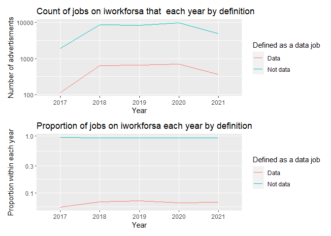
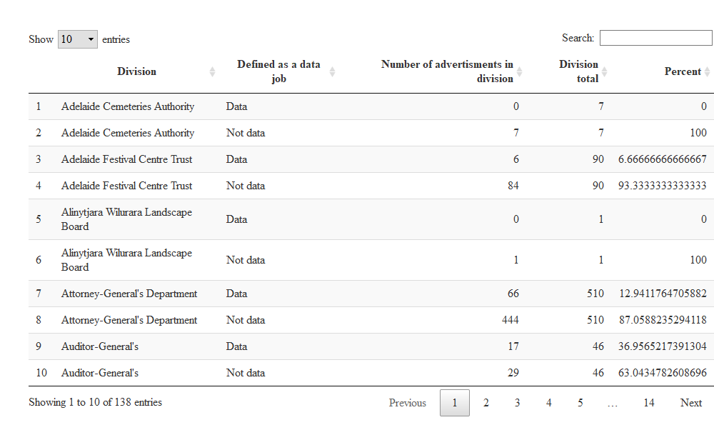

Historical extract from iworkforsa - lab book
================
ofchurches
28 June 2021

# Background

This markdown is a preliminary investigation of the data provided by the [Office of the Commissioner for Public Sector Employment](https://www.publicsector.sa.gov.au/).The data contains details from every advertisement on [iworkforsa.gov.au](https://iworkfor.sa.gov.au/).

Note that these data have been classified as "Public" by the OCPSE.

## Packages

``` r
library(readxl)
library(tidyverse)
library(here)
library(lubridate)
library(kableExtra)
library(naniar)
library(patchwork)
library(skimr)
library(DT)
library(ComplexUpset)
library(tidytext)
library(tidyr)
library(stringr)
library(scales)
library(widyr)
library(tidygraph)
library(ggraph)
```

## Import, arrange and format

``` r
path <- here("IWORK4SA Data 2017-2021, Classification-Public.xlsx")

advertiments <- path %>% 
  excel_sheets() %>%
  map_dfr(
    function(sheet) {
      temp = read_excel(sheet, path = path, skip = 8)
      mutate(temp, Year = sheet)
    }
  )
```

## Checks and balances

### Check the top and bottom of the data

Data read in from `xlsx` files often has bits of extra information above *and* below the actual "data". To check that we haven't accidentally imported that we can have a look at the top and bottom of our data set.

``` r
advertiments %>%
  slice_head(n = 6) %>%
  kable() %>%
  kable_styling()
```

<table class="table" style="margin-left: auto; margin-right: auto;">
<thead>
<tr>
<th style="text-align:left;">
Date Publish To Public Drill
</th>
<th style="text-align:left;">
Division
</th>
<th style="text-align:left;">
Position Status
</th>
<th style="text-align:left;">
I Workfor SA Classification Level
</th>
<th style="text-align:left;">
Position ID
</th>
<th style="text-align:left;">
Position ID Job Title
</th>
<th style="text-align:left;">
I Workfor SA Vacancy Type
</th>
<th style="text-align:left;">
I Workfor SA Part Time
</th>
<th style="text-align:left;">
I Workfor SA Part Time Hours
</th>
<th style="text-align:left;">
I Workfor SA Location
</th>
<th style="text-align:left;">
I Workfor SA Min Salary
</th>
<th style="text-align:left;">
I Workfor SA Max Salary
</th>
<th style="text-align:left;">
I Workfor SA Employment Status
</th>
<th style="text-align:left;">
I Workfor SA Job Category
</th>
<th style="text-align:left;">
Year
</th>
</tr>
</thead>
<tbody>
<tr>
<td style="text-align:left;">
2017-11-04
</td>
<td style="text-align:left;">
Department for Child Protection
</td>
<td style="text-align:left;">
Position Closed
</td>
<td style="text-align:left;">
AHP3 - Allied Health Professional
</td>
<td style="text-align:left;">
294895
</td>
<td style="text-align:left;">
294895 - Supervisor
</td>
<td style="text-align:left;">
Open to Everyone
</td>
<td style="text-align:left;">
No
</td>
<td style="text-align:left;">
0
</td>
<td style="text-align:left;">
5540 - PORT PIRIE
</td>
<td style="text-align:left;">
92757
</td>
<td style="text-align:left;">
98896
</td>
<td style="text-align:left;">
Ongoing
</td>
<td style="text-align:left;">
Community and Social Services, Child, Aged and Disability Care
</td>
<td style="text-align:left;">
2017
</td>
</tr>
<tr>
<td style="text-align:left;">
2017-11-04
</td>
<td style="text-align:left;">
Department for Child Protection
</td>
<td style="text-align:left;">
Position Closed
</td>
<td style="text-align:left;">
PO3 - Professional Officer
</td>
<td style="text-align:left;">
294897
</td>
<td style="text-align:left;">
294897 - Supervisor
</td>
<td style="text-align:left;">
Open to Everyone
</td>
<td style="text-align:left;">
No
</td>
<td style="text-align:left;">
0
</td>
<td style="text-align:left;">
5540 - PORT PIRIE
</td>
<td style="text-align:left;">
90029
</td>
<td style="text-align:left;">
95487
</td>
<td style="text-align:left;">
Ongoing
</td>
<td style="text-align:left;">
Community and Social Services, Child, Aged and Disability Care
</td>
<td style="text-align:left;">
2017
</td>
</tr>
<tr>
<td style="text-align:left;">
2017-11-04
</td>
<td style="text-align:left;">
Department for Education
</td>
<td style="text-align:left;">
Position Closed
</td>
<td style="text-align:left;">
AHP3 - Allied Health Professional
</td>
<td style="text-align:left;">
294898
</td>
<td style="text-align:left;">
294898 - Psychologist, Centre for Hearing Impaired
</td>
<td style="text-align:left;">
Open to Everyone
</td>
<td style="text-align:left;">
No
</td>
<td style="text-align:left;">
45
</td>
<td style="text-align:left;">
5000 - ADELAIDE
</td>
<td style="text-align:left;">
92757
</td>
<td style="text-align:left;">
98896
</td>
<td style="text-align:left;">
Ongoing
</td>
<td style="text-align:left;">
Community and Social Services, Child, Aged and Disability Care
</td>
<td style="text-align:left;">
2017
</td>
</tr>
<tr>
<td style="text-align:left;">
2017-11-04
</td>
<td style="text-align:left;">
Department for Education
</td>
<td style="text-align:left;">
Position Closed
</td>
<td style="text-align:left;">
AHP2 - Allied Health Professional
</td>
<td style="text-align:left;">
294899
</td>
<td style="text-align:left;">
294899 - Speech Pathologist, Centre for Hearing Impaired
</td>
<td style="text-align:left;">
Open to Everyone
</td>
<td style="text-align:left;">
No
</td>
<td style="text-align:left;">
45
</td>
<td style="text-align:left;">
5000 - ADELAIDE
</td>
<td style="text-align:left;">
77752
</td>
<td style="text-align:left;">
90029
</td>
<td style="text-align:left;">
Ongoing
</td>
<td style="text-align:left;">
Medical
</td>
<td style="text-align:left;">
2017
</td>
</tr>
<tr>
<td style="text-align:left;">
2017-11-04
</td>
<td style="text-align:left;">
Department for Infrastructure and Transport
</td>
<td style="text-align:left;">
Position Closed
</td>
<td style="text-align:left;">
ASO5 - Administrative Services Officer
</td>
<td style="text-align:left;">
294900
</td>
<td style="text-align:left;">
294900 - Senior Asset Inspection Officer
</td>
<td style="text-align:left;">
Open to Everyone
</td>
<td style="text-align:left;">
No
</td>
<td style="text-align:left;">
0
</td>
<td style="text-align:left;">
5037 - NETLEY
</td>
<td style="text-align:left;">
75430
</td>
<td style="text-align:left;">
84497
</td>
<td style="text-align:left;">
Short Term Contract
</td>
<td style="text-align:left;">
Maintenance and Facilities
</td>
<td style="text-align:left;">
2017
</td>
</tr>
<tr>
<td style="text-align:left;">
2017-11-04
</td>
<td style="text-align:left;">
Department for Infrastructure and Transport
</td>
<td style="text-align:left;">
Position Closed
</td>
<td style="text-align:left;">
ASO6 - Administrative Services Officer
</td>
<td style="text-align:left;">
294901
</td>
<td style="text-align:left;">
294901 - Asset Assurance Manager
</td>
<td style="text-align:left;">
Open to Everyone
</td>
<td style="text-align:left;">
No
</td>
<td style="text-align:left;">
0
</td>
<td style="text-align:left;">
5037 - NETLEY
</td>
<td style="text-align:left;">
87384
</td>
<td style="text-align:left;">
92743
</td>
<td style="text-align:left;">
Short Term Contract
</td>
<td style="text-align:left;">
Maintenance and Facilities
</td>
<td style="text-align:left;">
2017
</td>
</tr>
</tbody>
</table>
``` r
advertiments %>%
  slice_tail(n = 6) %>%
  kable() %>%
  kable_styling()
```

<table class="table" style="margin-left: auto; margin-right: auto;">
<thead>
<tr>
<th style="text-align:left;">
Date Publish To Public Drill
</th>
<th style="text-align:left;">
Division
</th>
<th style="text-align:left;">
Position Status
</th>
<th style="text-align:left;">
I Workfor SA Classification Level
</th>
<th style="text-align:left;">
Position ID
</th>
<th style="text-align:left;">
Position ID Job Title
</th>
<th style="text-align:left;">
I Workfor SA Vacancy Type
</th>
<th style="text-align:left;">
I Workfor SA Part Time
</th>
<th style="text-align:left;">
I Workfor SA Part Time Hours
</th>
<th style="text-align:left;">
I Workfor SA Location
</th>
<th style="text-align:left;">
I Workfor SA Min Salary
</th>
<th style="text-align:left;">
I Workfor SA Max Salary
</th>
<th style="text-align:left;">
I Workfor SA Employment Status
</th>
<th style="text-align:left;">
I Workfor SA Job Category
</th>
<th style="text-align:left;">
Year
</th>
</tr>
</thead>
<tbody>
<tr>
<td style="text-align:left;">
NA
</td>
<td style="text-align:left;">
TAFE SA
</td>
<td style="text-align:left;">
Created
</td>
<td style="text-align:left;">
NA
</td>
<td style="text-align:left;">
436727
</td>
<td style="text-align:left;">
436727 - Default template
</td>
<td style="text-align:left;">
NA
</td>
<td style="text-align:left;">
No
</td>
<td style="text-align:left;">
NA
</td>
<td style="text-align:left;">
5000 - ADELAIDE
</td>
<td style="text-align:left;">
NA
</td>
<td style="text-align:left;">
NA
</td>
<td style="text-align:left;">
NA
</td>
<td style="text-align:left;">
NA
</td>
<td style="text-align:left;">
2021
</td>
</tr>
<tr>
<td style="text-align:left;">
NA
</td>
<td style="text-align:left;">
Office of the Commissioner for Public Sector Employment
</td>
<td style="text-align:left;">
Created
</td>
<td style="text-align:left;">
NA
</td>
<td style="text-align:left;">
422698
</td>
<td style="text-align:left;">
422698 - Default template
</td>
<td style="text-align:left;">
NA
</td>
<td style="text-align:left;">
No
</td>
<td style="text-align:left;">
NA
</td>
<td style="text-align:left;">
5000 - ADELAIDE
</td>
<td style="text-align:left;">
NA
</td>
<td style="text-align:left;">
NA
</td>
<td style="text-align:left;">
NA
</td>
<td style="text-align:left;">
NA
</td>
<td style="text-align:left;">
2021
</td>
</tr>
<tr>
<td style="text-align:left;">
NA
</td>
<td style="text-align:left;">
Department for Correctional Services
</td>
<td style="text-align:left;">
Created
</td>
<td style="text-align:left;">
NA
</td>
<td style="text-align:left;">
434022
</td>
<td style="text-align:left;">
434022 - DCS template
</td>
<td style="text-align:left;">
NA
</td>
<td style="text-align:left;">
No
</td>
<td style="text-align:left;">
NA
</td>
<td style="text-align:left;">
5000 - ADELAIDE
</td>
<td style="text-align:left;">
NA
</td>
<td style="text-align:left;">
NA
</td>
<td style="text-align:left;">
NA
</td>
<td style="text-align:left;">
NA
</td>
<td style="text-align:left;">
2021
</td>
</tr>
<tr>
<td style="text-align:left;">
NA
</td>
<td style="text-align:left;">
Green Industries SA
</td>
<td style="text-align:left;">
Created
</td>
<td style="text-align:left;">
NA
</td>
<td style="text-align:left;">
439435
</td>
<td style="text-align:left;">
439435 - Default template
</td>
<td style="text-align:left;">
NA
</td>
<td style="text-align:left;">
No
</td>
<td style="text-align:left;">
NA
</td>
<td style="text-align:left;">
5000 - ADELAIDE
</td>
<td style="text-align:left;">
NA
</td>
<td style="text-align:left;">
NA
</td>
<td style="text-align:left;">
NA
</td>
<td style="text-align:left;">
NA
</td>
<td style="text-align:left;">
2021
</td>
</tr>
<tr>
<td style="text-align:left;">
NA
</td>
<td style="text-align:left;">
NA
</td>
<td style="text-align:left;">
NA
</td>
<td style="text-align:left;">
NA
</td>
<td style="text-align:left;">
NA
</td>
<td style="text-align:left;">
NA
</td>
<td style="text-align:left;">
NA
</td>
<td style="text-align:left;">
NA
</td>
<td style="text-align:left;">
NA
</td>
<td style="text-align:left;">
NA
</td>
<td style="text-align:left;">
NA
</td>
<td style="text-align:left;">
NA
</td>
<td style="text-align:left;">
NA
</td>
<td style="text-align:left;">
NA
</td>
<td style="text-align:left;">
2021
</td>
</tr>
<tr>
<td style="text-align:left;">
Report created on: 9/06/2021 3:42:28 PM
</td>
<td style="text-align:left;">
NA
</td>
<td style="text-align:left;">
NA
</td>
<td style="text-align:left;">
NA
</td>
<td style="text-align:left;">
NA
</td>
<td style="text-align:left;">
NA
</td>
<td style="text-align:left;">
NA
</td>
<td style="text-align:left;">
NA
</td>
<td style="text-align:left;">
NA
</td>
<td style="text-align:left;">
NA
</td>
<td style="text-align:left;">
NA
</td>
<td style="text-align:left;">
NA
</td>
<td style="text-align:left;">
NA
</td>
<td style="text-align:left;">
NA
</td>
<td style="text-align:left;">
2021
</td>
</tr>
</tbody>
</table>
It looks like we've imported some extra rows that we don't want because they were footer details and some `NA` whole rows. We can remove them.

``` r
advertiments_clean <- advertiments%>%
  filter(str_detect(`Date Publish To Public Drill`, "Report created") == FALSE | is.na(`Date Publish To Public Drill`) == TRUE) %>%
  filter(is.na(`Position ID Job Title`) == FALSE)
```

Just to check this again...we imported five sheets from the `xlsx` file so `advertiments_clean` should now have five less rows than `advertisments`. And, the difference in rows is: 10!

### Change format

Let's put the variables in a format that we can treat appropriately.

``` r
advertiments_formatted <- advertiments_clean %>% 
  mutate(`Date Publish To Public Drill` = ymd(`Date Publish To Public Drill`)) %>%
  mutate(`I Workfor SA Min Salary` = as.numeric(`I Workfor SA Min Salary`)) %>%
  mutate(`I Workfor SA Max Salary` = as.numeric(`I Workfor SA Max Salary`))
```

### What are we working with

It would be good to have a look at the data types in each variable to work out if its suitable for what we'll want to do in the analysis.

``` r
advertiments_formatted %>%
  skim()
```

<table style="width: auto;" class="table table-condensed">
<caption>
Data summary
</caption>
<thead>
<tr>
<th style="text-align:left;">
</th>
<th style="text-align:left;">
</th>
</tr>
</thead>
<tbody>
<tr>
<td style="text-align:left;">
Name
</td>
<td style="text-align:left;">
Piped data
</td>
</tr>
<tr>
<td style="text-align:left;">
Number of rows
</td>
<td style="text-align:left;">
35532
</td>
</tr>
<tr>
<td style="text-align:left;">
Number of columns
</td>
<td style="text-align:left;">
15
</td>
</tr>
<tr>
<td style="text-align:left;">
\_\_\_\_\_\_\_\_\_\_\_\_\_\_\_\_\_\_\_\_\_\_\_
</td>
<td style="text-align:left;">
</td>
</tr>
<tr>
<td style="text-align:left;">
Column type frequency:
</td>
<td style="text-align:left;">
</td>
</tr>
<tr>
<td style="text-align:left;">
character
</td>
<td style="text-align:left;">
12
</td>
</tr>
<tr>
<td style="text-align:left;">
Date
</td>
<td style="text-align:left;">
1
</td>
</tr>
<tr>
<td style="text-align:left;">
numeric
</td>
<td style="text-align:left;">
2
</td>
</tr>
<tr>
<td style="text-align:left;">
\_\_\_\_\_\_\_\_\_\_\_\_\_\_\_\_\_\_\_\_\_\_\_\_
</td>
<td style="text-align:left;">
</td>
</tr>
<tr>
<td style="text-align:left;">
Group variables
</td>
<td style="text-align:left;">
None
</td>
</tr>
</tbody>
</table>
**Variable type: character**

<table>
<thead>
<tr>
<th style="text-align:left;">
skim\_variable
</th>
<th style="text-align:right;">
n\_missing
</th>
<th style="text-align:right;">
complete\_rate
</th>
<th style="text-align:right;">
min
</th>
<th style="text-align:right;">
max
</th>
<th style="text-align:right;">
empty
</th>
<th style="text-align:right;">
n\_unique
</th>
<th style="text-align:right;">
whitespace
</th>
</tr>
</thead>
<tbody>
<tr>
<td style="text-align:left;">
Division
</td>
<td style="text-align:right;">
0
</td>
<td style="text-align:right;">
1.00
</td>
<td style="text-align:right;">
7
</td>
<td style="text-align:right;">
55
</td>
<td style="text-align:right;">
0
</td>
<td style="text-align:right;">
69
</td>
<td style="text-align:right;">
0
</td>
</tr>
<tr>
<td style="text-align:left;">
Position Status
</td>
<td style="text-align:right;">
0
</td>
<td style="text-align:right;">
1.00
</td>
<td style="text-align:right;">
4
</td>
<td style="text-align:right;">
32
</td>
<td style="text-align:right;">
0
</td>
<td style="text-align:right;">
9
</td>
<td style="text-align:right;">
0
</td>
</tr>
<tr>
<td style="text-align:left;">
I Workfor SA Classification Level
</td>
<td style="text-align:right;">
887
</td>
<td style="text-align:right;">
0.98
</td>
<td style="text-align:right;">
9
</td>
<td style="text-align:right;">
74
</td>
<td style="text-align:right;">
0
</td>
<td style="text-align:right;">
325
</td>
<td style="text-align:right;">
0
</td>
</tr>
<tr>
<td style="text-align:left;">
Position ID
</td>
<td style="text-align:right;">
0
</td>
<td style="text-align:right;">
1.00
</td>
<td style="text-align:right;">
6
</td>
<td style="text-align:right;">
6
</td>
<td style="text-align:right;">
0
</td>
<td style="text-align:right;">
35532
</td>
<td style="text-align:right;">
0
</td>
</tr>
<tr>
<td style="text-align:left;">
Position ID Job Title
</td>
<td style="text-align:right;">
0
</td>
<td style="text-align:right;">
1.00
</td>
<td style="text-align:right;">
8
</td>
<td style="text-align:right;">
163
</td>
<td style="text-align:right;">
0
</td>
<td style="text-align:right;">
35532
</td>
<td style="text-align:right;">
0
</td>
</tr>
<tr>
<td style="text-align:left;">
I Workfor SA Vacancy Type
</td>
<td style="text-align:right;">
448
</td>
<td style="text-align:right;">
0.99
</td>
<td style="text-align:right;">
16
</td>
<td style="text-align:right;">
31
</td>
<td style="text-align:right;">
0
</td>
<td style="text-align:right;">
2
</td>
<td style="text-align:right;">
0
</td>
</tr>
<tr>
<td style="text-align:left;">
I Workfor SA Part Time
</td>
<td style="text-align:right;">
0
</td>
<td style="text-align:right;">
1.00
</td>
<td style="text-align:right;">
2
</td>
<td style="text-align:right;">
3
</td>
<td style="text-align:right;">
0
</td>
<td style="text-align:right;">
2
</td>
<td style="text-align:right;">
0
</td>
</tr>
<tr>
<td style="text-align:left;">
I Workfor SA Part Time Hours
</td>
<td style="text-align:right;">
21410
</td>
<td style="text-align:right;">
0.40
</td>
<td style="text-align:right;">
1
</td>
<td style="text-align:right;">
14
</td>
<td style="text-align:right;">
0
</td>
<td style="text-align:right;">
383
</td>
<td style="text-align:right;">
0
</td>
</tr>
<tr>
<td style="text-align:left;">
I Workfor SA Location
</td>
<td style="text-align:right;">
40
</td>
<td style="text-align:right;">
1.00
</td>
<td style="text-align:right;">
11
</td>
<td style="text-align:right;">
44
</td>
<td style="text-align:right;">
0
</td>
<td style="text-align:right;">
320
</td>
<td style="text-align:right;">
0
</td>
</tr>
<tr>
<td style="text-align:left;">
I Workfor SA Employment Status
</td>
<td style="text-align:right;">
451
</td>
<td style="text-align:right;">
0.99
</td>
<td style="text-align:right;">
6
</td>
<td style="text-align:right;">
19
</td>
<td style="text-align:right;">
0
</td>
<td style="text-align:right;">
4
</td>
<td style="text-align:right;">
0
</td>
</tr>
<tr>
<td style="text-align:left;">
I Workfor SA Job Category
</td>
<td style="text-align:right;">
453
</td>
<td style="text-align:right;">
0.99
</td>
<td style="text-align:right;">
6
</td>
<td style="text-align:right;">
62
</td>
<td style="text-align:right;">
0
</td>
<td style="text-align:right;">
41
</td>
<td style="text-align:right;">
0
</td>
</tr>
<tr>
<td style="text-align:left;">
Year
</td>
<td style="text-align:right;">
0
</td>
<td style="text-align:right;">
1.00
</td>
<td style="text-align:right;">
4
</td>
<td style="text-align:right;">
4
</td>
<td style="text-align:right;">
0
</td>
<td style="text-align:right;">
5
</td>
<td style="text-align:right;">
0
</td>
</tr>
</tbody>
</table>
**Variable type: Date**

<table>
<thead>
<tr>
<th style="text-align:left;">
skim\_variable
</th>
<th style="text-align:right;">
n\_missing
</th>
<th style="text-align:right;">
complete\_rate
</th>
<th style="text-align:left;">
min
</th>
<th style="text-align:left;">
max
</th>
<th style="text-align:left;">
median
</th>
<th style="text-align:right;">
n\_unique
</th>
</tr>
</thead>
<tbody>
<tr>
<td style="text-align:left;">
Date Publish To Public Drill
</td>
<td style="text-align:right;">
2384
</td>
<td style="text-align:right;">
0.93
</td>
<td style="text-align:left;">
2017-11-04
</td>
<td style="text-align:left;">
2021-06-08
</td>
<td style="text-align:left;">
2019-09-24
</td>
<td style="text-align:right;">
1017
</td>
</tr>
</tbody>
</table>
**Variable type: numeric**

<table>
<thead>
<tr>
<th style="text-align:left;">
skim\_variable
</th>
<th style="text-align:right;">
n\_missing
</th>
<th style="text-align:right;">
complete\_rate
</th>
<th style="text-align:right;">
mean
</th>
<th style="text-align:right;">
sd
</th>
<th style="text-align:right;">
p0
</th>
<th style="text-align:right;">
p25
</th>
<th style="text-align:right;">
p50
</th>
<th style="text-align:right;">
p75
</th>
<th style="text-align:right;">
p100
</th>
<th style="text-align:left;">
hist
</th>
</tr>
</thead>
<tbody>
<tr>
<td style="text-align:left;">
I Workfor SA Min Salary
</td>
<td style="text-align:right;">
826
</td>
<td style="text-align:right;">
0.98
</td>
<td style="text-align:right;">
75939.52
</td>
<td style="text-align:right;">
30251.57
</td>
<td style="text-align:right;">
0
</td>
<td style="text-align:right;">
60681
</td>
<td style="text-align:right;">
75430
</td>
<td style="text-align:right;">
92784
</td>
<td style="text-align:right;">
324141
</td>
<td style="text-align:left;">
&lt;U+2586&gt;&lt;U+2587&gt;&lt;U+2581&gt;&lt;U+2581&gt;&lt;U+2581&gt;
</td>
</tr>
<tr>
<td style="text-align:left;">
I Workfor SA Max Salary
</td>
<td style="text-align:right;">
826
</td>
<td style="text-align:right;">
0.98
</td>
<td style="text-align:right;">
87480.98
</td>
<td style="text-align:right;">
38156.83
</td>
<td style="text-align:right;">
0
</td>
<td style="text-align:right;">
66368
</td>
<td style="text-align:right;">
88420
</td>
<td style="text-align:right;">
101685
</td>
<td style="text-align:right;">
413381
</td>
<td style="text-align:left;">
&lt;U+2585&gt;&lt;U+2587&gt;&lt;U+2581&gt;&lt;U+2581&gt;&lt;U+2581&gt;
</td>
</tr>
</tbody>
</table>
The completeness of `Position ID Job Title` looks really promising and the completeness of `I Workfor SA Min Salary` and `I Workfor SA Max Salary` is hopeful too.

### Missing data

``` r
advertiments_formatted %>%
  gg_miss_var(show_pct = TRUE, facet = Year) +
  labs(title = str_wrap("Percent of missing data for each variable in `advertisments`", width = 50))
```


It seems that all the variables except `I Workfor SA Part Time Hours` have minimal missing values and none of this changes much over time.

``` r
gg_miss_upset(advertiments_formatted)
```


It's reassuring that `I Workfor SA Min Salary` and `I Workfor SA MAX Salary` are only missing in combination with each other (and sometimes with `I Workfor SA Part Time Hours` as well).

The only note that appears particularly pertinent from these analyses is that `I Workfor SA Part Time Hours` should be treated with caution. We should note that the variables: `Division`, `Position Status`, `Position ID`, `Position ID Job Title`, `I Workfor SA Part Time` and `Year` are all complete with no missing values.

# Analyses

## "Data" jobs

The motivation for getting these data was to look at advertisements for "data" jobs to investigate questions such as:

-   Are they increasing as a proportion of the advertisements?
-   What departments are recruiting them?
-   What sort of work are they being anticipated to do?

### Definition and caveats

To answer this question we need a definition of "data" jobs.

We can do this by including words and word-parts that signify the sort of job we are interested in. It is worth stating up front that this is necessarily a decision process rather than a data process. That is, the jobs we end up with classified as "data" and "not data" will be so classified because of our subjective *decision* not because of some objective *data*. In addition, this has a signal detection characteristic in that there will be errors due both to some "not data" jobs which end up classified as "data jobs" and some "data jobs" that end up classified as "not data jobs".

### Definition

Regardless, we can set the definition and accept these caveats. Importantly, because the new variable `Defined as a data job` is based on `Position ID Job Title`, there will be no missing values in this new variable. Its worth noting that this step can (and should) be changed as we think more or less terms are applicable.

Its worth noting that there is a variable called `I Workfor SA Job Category` that is fairly complete. However, because its not actually complete, its not suitable for basing our definition on.

Data jobs will be defined as `Position ID Job Title` that contain:

``` r
data_job_definitions <- c("data", "analy", "information", "intelligence", "statistic", "scien", "research", "tech")
```

Then we can append this definition to the data frame:

``` r
advertiments_defined <- advertiments_formatted %>% 
  mutate(`Position ID Job Title` = str_to_lower(`Position ID Job Title`)) %>%
  mutate(`Defined as a data job` = ifelse(str_detect(`Position ID Job Title`, 
                                                     paste(data_job_definitions, collapse = "|")
                                                     ), 
         "Data", "Not data"))
```

As a check on our definitions, we should see how often each occur.

``` r
data_job_type <- advertiments_defined %>%
  select(`Position ID Job Title`) %>%
  mutate(`Is "data"` = ifelse(str_detect(str_to_lower(`Position ID Job Title`), 
                                         data_job_definitions[1]), 1, 0)) %>%
  mutate(`Is "analy"` = ifelse(str_detect(str_to_lower(`Position ID Job Title`), 
                                         data_job_definitions[2]), 1, 0)) %>%
  mutate(`Is "information"` = ifelse(str_detect(str_to_lower(`Position ID Job Title`), 
                                         data_job_definitions[3]), 1, 0)) %>%
  mutate(`Is "intelligence"` = ifelse(str_detect(str_to_lower(`Position ID Job Title`), 
                                         data_job_definitions[4]), 1, 0)) %>%
  mutate(`Is "statistic"` = ifelse(str_detect(str_to_lower(`Position ID Job Title`), 
                                         data_job_definitions[5]), 1, 0)) %>%
  mutate(`Is "scien"` = ifelse(str_detect(str_to_lower(`Position ID Job Title`),
                                         data_job_definitions[6]), 1, 0)) %>%
  mutate(`Is "research"` = ifelse(str_detect(str_to_lower(`Position ID Job Title`),
                                         data_job_definitions[7]), 1, 0)) %>%
    mutate(`Is "tech"` = ifelse(str_detect(str_to_lower(`Position ID Job Title`),
                                         data_job_definitions[8]), 1, 0)) 

data_job_type %>%
  select(-`Position ID Job Title`) %>%
  pivot_longer(cols = everything(), names_to = "Data job type", values_to = "Count") %>%
  group_by(`Data job type`) %>%
  summarise(Count = sum(Count)) %>%
  ggplot(aes(x = reorder(`Data job type`, -Count), y = Count, fill = `Data job type`)) + 
  geom_col() + 
  theme(legend.position = "none") + 
  labs(x = "Data job type", title = "Counts of data job types")
```


This seems pretty plausible. Lets also check how they join together within a single `Position ID Job Title`.

``` r
data_job_type %>%
  select(-`Position ID Job Title`) %>%
  filter_all(any_vars(. == 1)) %>%
  upset(colnames(data_job_type[2:9]))
```


So there were 5 "data scientists". Seems pretty plausible

Before we move onto the answers to our questions, lets just have a look at the most frequent "Data" and "Not data" jobs.

``` r
advertiments_title <- advertiments_defined %>%
  mutate("Position ID check" = str_extract(`Position ID Job Title`, `Position ID`)) %>%
  mutate("Job title" = str_remove(`Position ID Job Title`, paste0(`Position ID`, " - ")))
```

Did we extract the `Position ID` correctly? Yes!

So lets remove the `Position ID` from the `Position ID Job Title` to get the `JOb Title`.

``` r
advertiments_title %>%
  group_by(`Defined as a data job`) %>%
  count(`Job title`) %>%
  top_n(15) %>%
  ungroup() %>%
  mutate(`Defined as a data job` = as.factor(`Defined as a data job`),
         `Job title` = reorder_within(`Job title`, n, `Defined as a data job`)) %>%
  ggplot(aes(`Job title`, n, fill = `Defined as a data job`)) +
  geom_col(show.legend = FALSE) +
  facet_wrap(~`Defined as a data job`, scales = "free") +
  coord_flip() +
  scale_x_reordered() +
  scale_y_continuous(expand = c(0,0)) +
  labs(y = "Count of times 'Job title' was advertised",
       x = NULL,
       title = "Most common job titles by category")
```

    ## Selecting by n


This raises some serious side questions such as:

-   what does a "iworkfoesa template" do for a job?
-   There are a bunch of roles with the first word of "Senior". I wonder if there are comparable `Job title` without that prefix?

## Answers

### Are "data jobs" increasing as a proportion of the advertisments?

``` r
increasing_data <- advertiments_title %>%
  group_by(`Defined as a data job`, Year) %>%
  count(name = "Number of advertisments") %>%
  group_by(Year) %>%
  mutate(`Proportion within each year`= `Number of advertisments`/sum(`Number of advertisments`))

count_plot <- increasing_data %>%
  ggplot(aes(x = Year, y = `Number of advertisments`, colour = `Defined as a data job`, group = `Defined as a data job`)) + 
  geom_line() + 
  scale_y_log10() + 
  labs(title = "Count of jobs on iworkforsa that  each year by definition")

prop_plot <- increasing_data %>%
  ggplot(aes(x = Year, y = `Proportion within each year`, colour = `Defined as a data job`, group = `Defined as a data job`)) + 
  geom_line() + 
  scale_y_log10() + 
  labs(title = "Proportion of jobs on iworkforsa each year by definition")

count_plot/prop_plot
```



``` r
increasing_data %>%
  filter(`Defined as a data job` == "Data") %>%
  kable() %>%
  kable_styling()
```

<table class="table" style="margin-left: auto; margin-right: auto;">
<thead>
<tr>
<th style="text-align:left;">
Defined as a data job
</th>
<th style="text-align:left;">
Year
</th>
<th style="text-align:right;">
Number of advertisments
</th>
<th style="text-align:right;">
Proportion within each year
</th>
</tr>
</thead>
<tbody>
<tr>
<td style="text-align:left;">
Data
</td>
<td style="text-align:left;">
2017
</td>
<td style="text-align:right;">
114
</td>
<td style="text-align:right;">
0.0566882
</td>
</tr>
<tr>
<td style="text-align:left;">
Data
</td>
<td style="text-align:left;">
2018
</td>
<td style="text-align:right;">
644
</td>
<td style="text-align:right;">
0.0705135
</td>
</tr>
<tr>
<td style="text-align:left;">
Data
</td>
<td style="text-align:left;">
2019
</td>
<td style="text-align:right;">
657
</td>
<td style="text-align:right;">
0.0732441
</td>
</tr>
<tr>
<td style="text-align:left;">
Data
</td>
<td style="text-align:left;">
2020
</td>
<td style="text-align:right;">
690
</td>
<td style="text-align:right;">
0.0673894
</td>
</tr>
<tr>
<td style="text-align:left;">
Data
</td>
<td style="text-align:left;">
2021
</td>
<td style="text-align:right;">
357
</td>
<td style="text-align:right;">
0.0689322
</td>
</tr>
</tbody>
</table>
This certainly doesn't make it look as though there has been an *explosion* in the proportion of "data" jobs advertised over the last four years. There were 46 more "data" jobs in 2020 than in 2018. While this is a 93.3333333 percent increase in the number of these jobs that were advertised, it is worth noting that this is only an increase from a percent of 7.0513522 in 2018 to 6.7389393 in 2020 of the overall number of jobs that were advertised. That is an increase in just -0.3124129 percent.

### What departments are recruiting them?

``` r
departments_data <- advertiments_title %>%
  group_by(Division, `Defined as a data job`) %>%
  count(name = "Number of advertisments in division") %>%
  ungroup() %>%
  complete(Division, `Defined as a data job`, fill = list(`Number of advertisments in division` = 0)) %>%
  group_by(Division) %>%
  mutate("Division total" = sum(`Number of advertisments in division`)) %>%
  ungroup() %>%
  mutate("Percent" = (`Number of advertisments in division`/`Division total`)*100)

most_data_departments <- departments_data %>%
  filter(`Defined as a data job` == "Data") %>%
  slice_max(order_by = Percent, n = 12) %>%
  pull(Division)

departments_data  %>%
  filter(Division %in% most_data_departments) %>%
  mutate(Division = factor(Division, levels = most_data_departments, ordered = TRUE)) %>%
  ggplot(aes(x = Division, 
             y = Percent, 
             fill = `Defined as a data job`)) + 
  geom_col(position = "dodge") + 
  labs(title = "Divisions with the greatest proportion of 'data' job advertiments", 
       x = "") + 
  scale_x_discrete(limits=rev) +
  coord_flip()
```


A more comprehensive investigation of these data can be made in the table below:

``` r
datatable(departments_data)
```



So, the Department of Health and Wellbeing has the greatest *number* of "data" job advertisements: 1325. But, it also has one of the smallest *percentages* of data job advertisements: 5.9727732%.

It is worth noting that there are multiple explanations for the differences in the number of advertisements of "data" jobs between the Divisions. \* Divisions that "data" people like working in may keep their staff for longer and so advertise less \* Some divisions may have recruited more "data" people in an earlier time period \* Some divisions may not be hiring as many "data" people as they think they are

### What sort of work are they being anticipated to do?

Using the `Position ID Job Title`, we can see what other words appear alongside those used to define `Defined as a data job`.

Lets start by looking at the words most frequently occurring in those jobs that we classified as `Defined as a data job == "Data"`.

``` r
advertiments_unnest <- advertiments_title %>%
  #select(`Defined as a data job`, `Job title`) %>%
  unnest_tokens(Word, `Job title`)

advertiments_unnest %>%
  filter(`Defined as a data job` == "Data") %>%
  count(Word, name = "Number of occurances") %>%
  slice_max(order_by = `Number of occurances`, n = 12) %>%
  ggplot(aes(x = reorder(Word, `Number of occurances`), y = `Number of occurances`, fill = Word)) +
  geom_col() + 
  coord_flip()  + 
  theme(legend.position = "none") + 
  labs(x = "", title = "Most used words used in 'data' job advertisments")
```


It would be more instructive to see the words that most *differentiate* between "Data" and "Not data" jobs:

``` r
advertisments_frequency <- advertiments_unnest %>% 
  group_by(`Defined as a data job`) %>% 
  count(Word, sort = TRUE) %>% 
  left_join(advertiments_unnest %>% 
              group_by(`Defined as a data job`) %>% 
              summarise(total = n())) %>%
  mutate(Frequency = n/total) %>% 
  select(`Defined as a data job`, Word, Frequency) %>% 
  pivot_wider(names_from = `Defined as a data job`, values_from = Frequency) %>%
  arrange(Data, `Not data`)

ggplot(advertisments_frequency, aes(Data, `Not data`)) +
  geom_jitter(alpha = 0.1, size = 2.5, width = 0.25, height = 0.25) +
  geom_text(aes(label = Word), check_overlap = TRUE, vjust = 1.5) +
  scale_x_log10(labels = percent_format()) +
  scale_y_log10(labels = percent_format()) +
  geom_abline(color = "red")
```


Words near the red line are used with similar frequencies in the `Position ID Job Title` of "Data" and "Not data" jobs. Words further from the red line are used disproportionately in one set of `Position ID Job Title`. Hence, "programmer" is used predominantly in "Data" jobs while "social" is used predominantly in "Not data" jobs.

We could also look at the log-odds ratios between the categories:

``` r
word_ratios <- advertiments_unnest %>%
  count(Word, `Defined as a data job`) %>%
  group_by(Word) %>%
  filter(sum(n) >= 10) %>%
  ungroup() %>%
  pivot_wider(names_from = `Defined as a data job`, values_from = n, values_fill = 0) %>%
  mutate_if(is.numeric, list(~(. + 1) / (sum(.) + 1))) %>%
  mutate(logratio = log(`Data` / `Not data`)) %>%
  arrange(desc(logratio))

word_ratios %>%
  group_by(logratio < 0) %>%
  slice_max(abs(logratio), n = 15) %>% 
  ungroup() %>%
  mutate(word = reorder(Word, logratio)) %>%
  ggplot(aes(word, logratio, fill = logratio < 0)) +
  geom_col() +
  coord_flip() +
  ylab("log odds ratio (David/Julia)") +
  scale_fill_discrete(name = "", labels = c("Data", "Not dat"))
```


So, a lot of the words that are found have the actual stem we included in the definition of "Data" jobs in the first place. But removing them would remove both "technical" and "technician" and its interesting to note that both are present.

Finally, it might be instructive to see which words are used together in the "Data" job advertisements.

``` r
advertiments_unnest %>% 
  filter(`Defined as a data job` == "Data") %>%
  select(Word, `Position ID Job Title`) %>%
  rename(Title = `Position ID Job Title`) %>%
  pairwise_count(Word, Title, sort = TRUE, upper = FALSE) %>%
  filter(n >= 15) %>%
  as_tbl_graph() %>%
  to_undirected %>%
  activate(nodes) %>%
  mutate(degree = centrality_degree() / local_ave_degree()) %>%
  mutate(community = as.factor(group_fast_greedy())) %>%
  ggraph(layout = "fr") +
  geom_edge_link(aes(edge_alpha = n, edge_width = n)) +
  geom_node_point(aes(size = degree, colour = community)) +
  geom_node_text(aes(label = name), repel = TRUE, 
                 point.padding = unit(0.2, "lines")) +
  theme_void() + 
  theme(legend.position = "none")
```


It appears that there are some meaningful clusters. Within the connected component, the two biggest clusters seem associated with roles that might be related to "business intelligence" and "freedom of information". Its worth noting that "data" itself is quite central to the network overall.
